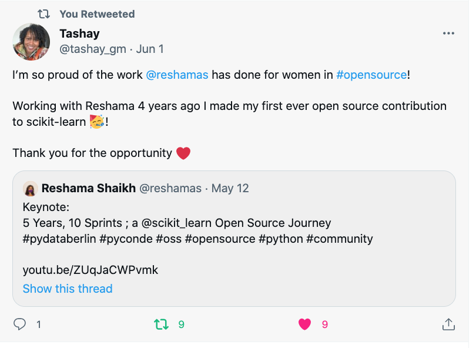

# Data Umbrella: Impact

Here, we share and celebrate the impact that Data Umbrella has had in the data science community.  

If you have a win to share, please:  
- Email us at:  info@dataumbrella .org
- Twitter: tag us with "@DataUmbrella" & [#DataUmbrellaImpact](https://twitter.com/search?q=%23DataUmbrellaImpact&src=typed_query&f=top)

## Daniel Saunders: 2023 Google Summer of Code Intern with PyMC
Daniel Saunders participated in the July 2022 PyMC Open Source Working Sessions, and in June 2023, joined the PyMC project as a Google Summer of Code intern.

Daniel shares in the [PyMC 2023 Interns blog](https://www.pymc.io/blog/blog_gsoc_2023.html
>I participated in a PyMC sprint in July 2022, organized with Data Umbrella. I remember Reshama Shaikh, Ravin Kumar, Rowan Schaefer, and Oriol Abril Pla being really nice and super helpful. They taught me how git works and how to tidy up doc strings.
Juan Martín Loyola joined the Data Umbrella Latin America sprint in June 2021, and he was an invited contributor to the Data Umbrella Africa and Middle East sprint in October 2021.  In this interview, learn more about Juan Martín's journey in open source. From a computer user to first contributing to PyMC, then Google Summer of Code, Data Umbrella's Latin America #ScikitLearnSprint, to Triage Team member with scikit-learn.

## Gloria Macia: Shared open source experience at PyData London

[Gloria Macia](https://www.linkedin.com/in/gloriamacia/) presented a 5-minute lightning talk at PyData London in July 2022 entitled "Contributing to Open Source and Inclusiveness in Tech", for which she won the best prize award. 

   

<iframe width="560" height="315" src="https://www.youtube.com/embed/t8dNB7g56HY" title="YouTube video player" frameborder="0" allow="accelerometer; autoplay; clipboard-write; encrypted-media; gyroscope; picture-in-picture" allowfullscreen></iframe>

 

[Chris Laffra on Twitter](https://twitter.com/laffra/status/1538577051464126465):  
> Congratulations to @GloriaMacia_ for winning JP Morgan's Python award at PyData London. I am going to take a closer look at @DataUmbrella now, for sure! Thanks Gloria for sharing this project with us. More information at: [dataumbrella.org](http://dataumbrella.org)

[Chris Laffra on LinkedIn](https://www.linkedin.com/posts/chrislaffra_i-am-happy-to-share-that-the-jp-morgan-python-activity-6944339599607382016-HWQU?utm_source=linkedin_share&utm_medium=member_desktop_web):  
>I am happy to share that the JP Morgan Python award at PyData London 2022 went to Gloria Macia, who gave a highly engaging explanation of the Data Umbrella project. The project's mission is to provide a welcoming and educational space for under-represented persons in the fields of machine learning, data science, and artificial intelligence. A great project I will look into in more detail. Thank you Gloria!"

## Juan Martín Loyola: Joins scikit-learn Triage Team

Juan Martín Loyola joined the Data Umbrella Latin America sprint in June 2021, and he was an invited contributor to the Data Umbrella Africa and Middle East sprint in October 2021.  In this interview, learn more about Juan Martín's journey in open source. From a computer user to first contributing to PyMC, then Google Summer of Code, Data Umbrella's Latin America #ScikitLearnSprint, to Triage Team member with scikit-learn.

<blockquote class="twitter-tweet">
We are happy to welcome Triage Team Member Juan Martín Loyola from Argentina.  Learn more about <a href="https://twitter.com/jmartinloyola?ref_src=twsrc%5Etfw">@jmartinloyola</a>:  • journey thru open source • CS -&gt; <a href="https://twitter.com/pymc_devs?ref_src=twsrc%5Etfw">@pymc_devs</a> -&gt; <a href="https://twitter.com/hashtag/GSoC?src=hash&amp;ref_src=twsrc%5Etfw">#GSoC</a> -&gt; <a href="https://twitter.com/DataUmbrella?ref_src=twsrc%5Etfw">@DataUmbrella</a> sprint -&gt; scikit-learn Triage • faves: resources, books, music, +<a href="https://t.co/vcCs2U2Z2x">https://t.co/vcCs2U2Z2x</a> <a href="https://t.co/Q8um3o6F8j">pic.twitter.com/Q8um3o6F8j</a>
&mdash; scikit-learn (@scikit_learn) <a href="https://twitter.com/scikit_learn/status/1476709023961567235?ref_src=twsrc%5Etfw">December 31, 2021</a></blockquote> 

## Amanda Dsouza: Contribution to scikit-learn

In this open source contribution, Amanda is one of the contributors to deprecate the `sklearn.datasets.load_boston` function.  The design of this dataset casually assumes that people prefer to buy housing in racially segregated neighborhoods.

<blockquote class="twitter-tweet">
One of the contributors on this significant PR is <a href="https://twitter.com/amanda_dsouza?ref_src=twsrc%5Etfw">@amanda_dsouza</a>, from multiple <a href="https://twitter.com/hashtag/ScikitLearnSprint?src=hash&amp;ref_src=twsrc%5Etfw">#ScikitLearnSprint</a> events.  As an organizer, it is immensely gratifying to see &amp; share impact in community work. <a href="https://twitter.com/codeforsociety?ref_src=twsrc%5Etfw">@codeforsociety</a> <a href="https://t.co/SCllQNoXwU">https://t.co/SCllQNoXwU</a>
&mdash; Reshama Shaikh (@reshamas) <a href="https://twitter.com/reshamas/status/1443019995806588932?ref_src=twsrc%5Etfw">September 29, 2021</a></blockquote> 

### Maren Westerman: Contribution to scikit-learn

 <blockquote class="twitter-tweet">
With today&#39;s sprint I made it into the scikit-learn top 100 contributers list by number of commits. This says nothing about the quality of my work but I&#39;m still proud of my achievement. 😁
&mdash; Maren Westermann (@MarenWestermann) <a href="https://twitter.com/MarenWestermann/status/1502683328226463746?ref_src=twsrc%5Etfw">March 12, 2022</a></blockquote> 

## Purna Chandra Mansingh

   

## Tashay Green
 

   

 
 
 
