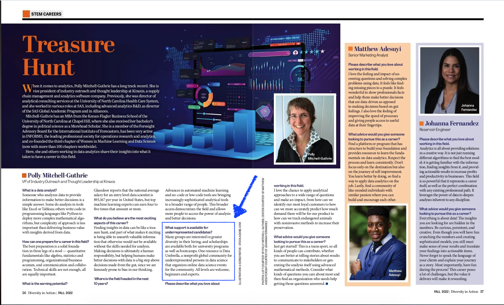

### Data Umbrella receives a mention in this research publication: [Insights and Impact From Five Cycles of Essential Open Source Software for Science](https://zenodo.org/records/11201216)  (July 16, 2024)

*Open source software (OSS) is crucial to advance scientific discovery. In particular, biomedical research increasingly depends on computational analysis, and OSS has become critical to making these methods broadly accessible. Despite a steady increase in demand from the scientific community for usable, scalable, secure, and reliable OSS, funding to support the needs of the communities that create it and maintain it has been limited.*  

*For the past five years, the Chan Zuckerberg Initiative has supported the maintenance, growth, development, and community engagement for critical open source tools that are used globally in the life sciences through its Essential Open Source Software for Science (EOSS) program. To our knowledge at the time of writing, this program (193 grants with $51.8 million in funding) represents the largest initiative to meet these needs. Stories and data from this unique grantee community represent one of the best available accounts on the impact of the open source foundations of science, and the urgent need to continue and expand support for them. In this report, we set out to review the impact of the first five cycles of the EOSS program to date from multiple perspectives and a variety of data sources, highlighting the support required to sustain OSS as well as the successes of our community. Questions we addressed and associated key findings include:*

1. *What Support Does the Scientific Open Source Community Need?*
2. *What Activities Did the Program Fund?*
3. *How Did the Program Impact Funded Software Projects?*
4. *How Did the Program Impact the Broader Open Source Community?*   
5. *How Did the Program Impact Diverse Participation in Scientific Open Source?* 
6. *How Did EOSS-Funded Projects Impact Biomedical Research?* 

### Data Umbrella receives a mention in Gordon and Betty Moore Foundation article: [Cultivating and connecting global data science communities](https://www.moore.org/article-detail?newsUrlName=cultivating-and-connecting-global-data-science-communities) (April 14, 2023)

*Through this program, funders and grantees alike have been able to expand their global reach. To date, the Event Fund has awarded over $525,000 to three cohorts of grantees from 27 different countries. Examples include:*

*Data Umbrella works to increase participation of underrepresented persons in data science, open sources and Python from the regions of Africa, the Middle East and South Asia. With the Event Fund support, Data Umbrella hosted scikit-learn sprints for those in Latin America, Africa, and the Middle East towards expanding their community and contributing to their software sustainability.*

### Data Umbrella receives mention in PLOS Journal: [Ten simple rules for funding scientific open source software](https://journals.plos.org/ploscompbiol/article?id=10.1371/journal.pcbi.1010627) (Nov 2022)

This article was recently published in the PLOS Journal by funders at CZI and the Sloan Foundation.  Data Umbrella received a mention in there for community building:  

*Groups like Outreachy, Data Umbrella, and PyLadies are all great examples of communities of practice that specialize in promoting and supporting underrepresented groups. Local communities of practice are also important: They have cultural, geographic, and human language expertise that can make open source interactions more welcoming for new participants from the area.*

### Data Umbrella receives mention in [Diversity in Action](https://mydigitalpublication.com/publication/?m=46265&i=763269&p=58&ver=html5) magazine (Oct 2022)

[Polly Mitchell-Guthrie](https://www.linkedin.com/in/pollymitchellguthrie/), a community member and a long-time proponent of diversity, was interviewed by the magazine [Diversity in Action](https://mydigitalpublication.com/publication/?m=46265&i=763269&p=58&ver=html5) on her career in data analytics.  She shared Data Umbrella as a community which supports underrepresented persons. The full article is available on pages 56 and 57.

   

### [Data Umbrella, an Event Fund Grantee, Awarded CZI Grant](https://www.codeforsociety.org/eventfund/updates/data-umbrella-an-event-fund-grantee-awarded-czi-grant) (Oct 2021)

Data Umbrella, a Code for Science and Society Event Fund grantee, has been awarded a grant by the [Chan Zuckerberg Initiative](https://chanzuckerberg.com/) as part of CZI Science efforts to support [diversity and inclusion in computational science](https://cziscience.medium.com/advancing-diversity-and-inclusion-in-scientific-open-source-eaabe6a5488b). 

### [Announcing the New Cohort of Event Fund Grantees!](https://eventfund.codeforscience.org/announcing-the-new-cohort-of-event-fund-grantees/) (Sep 2021)

Data Umbrella receives an event fund grant to increase the participation of underrepresented persons in data science, open source, and Python from the regions of [Africa and the Middle East](https://afme2021rc.dataumbrella.org/home). 
 
### [Announcing the Inaugural Cohort of Event Fund Grantees!](https://eventfund.codeforscience.org/announcing/) (Jan 2021)

Data Umbrella receives a grant for two sprints to increase the participation of underrepresented persons in data science, open source, and Python from the regions of [Africa, the Middle East](https://afme2021.dataumbrella.org/home) and [Latin America](https://latam2021.dataumbrella.org/home). 

