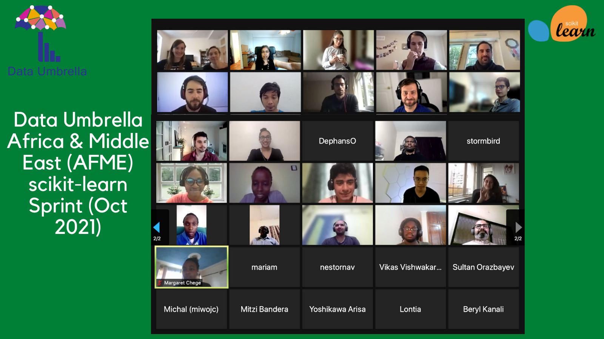
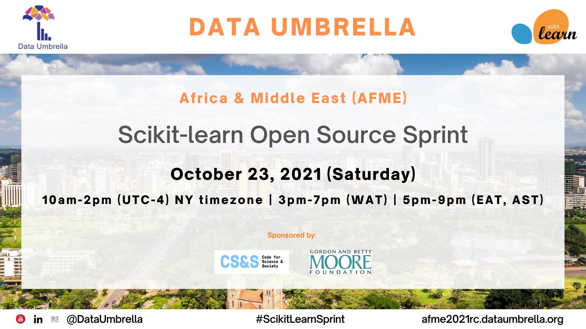
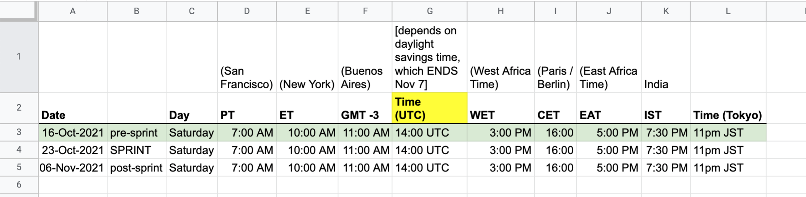
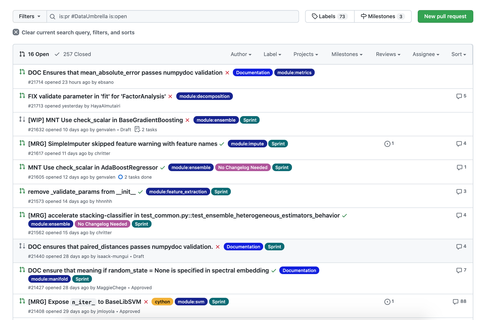
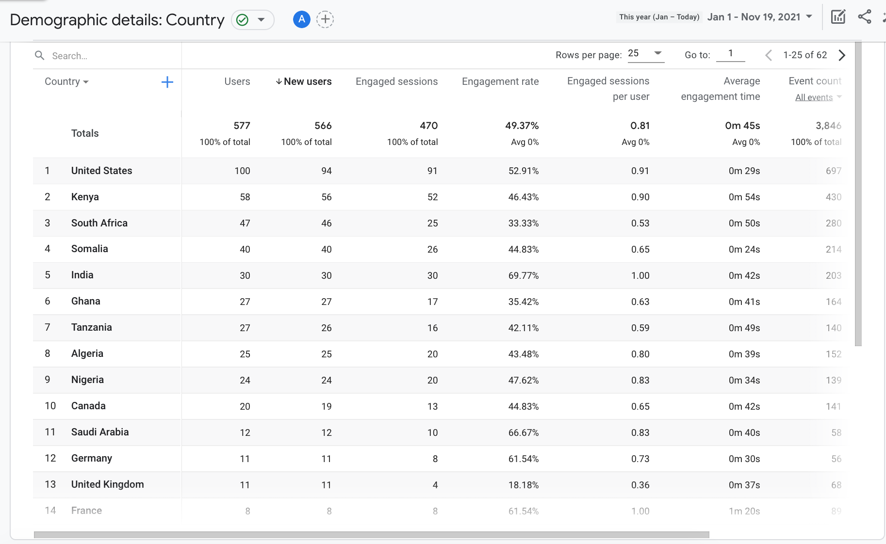
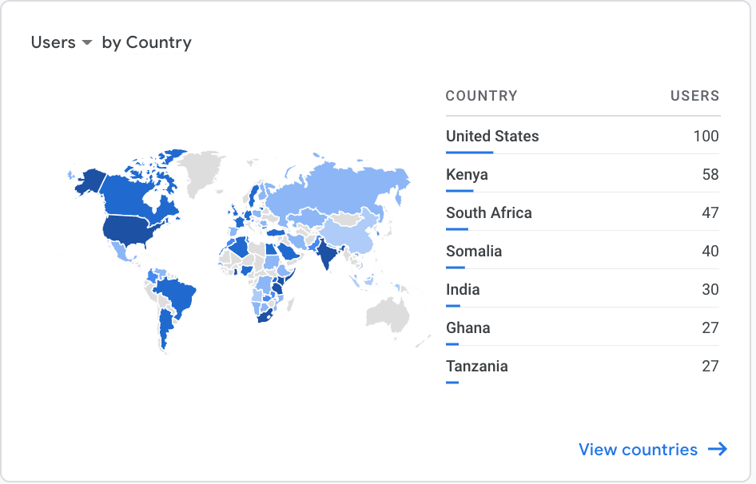
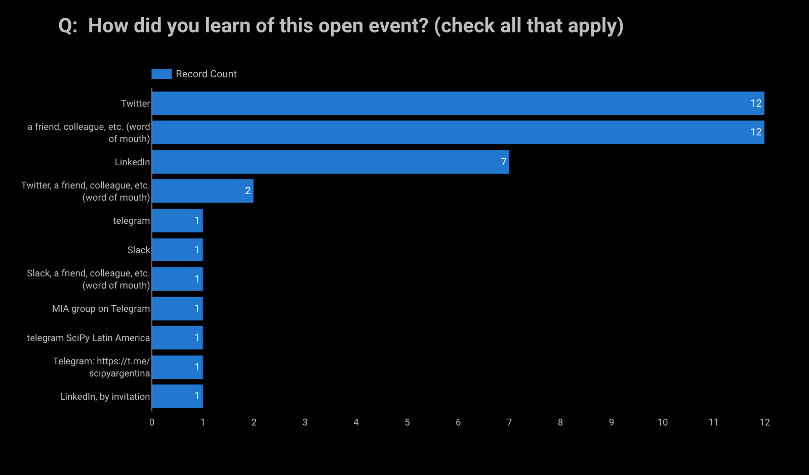
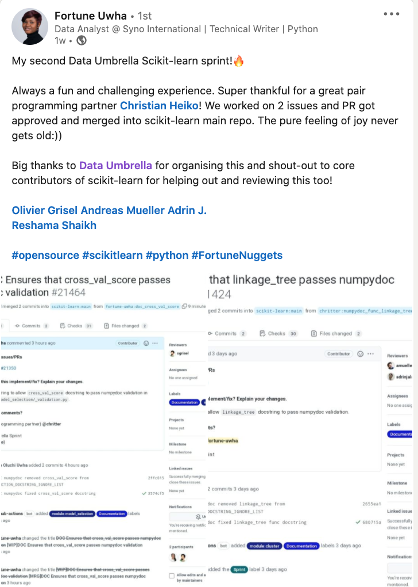
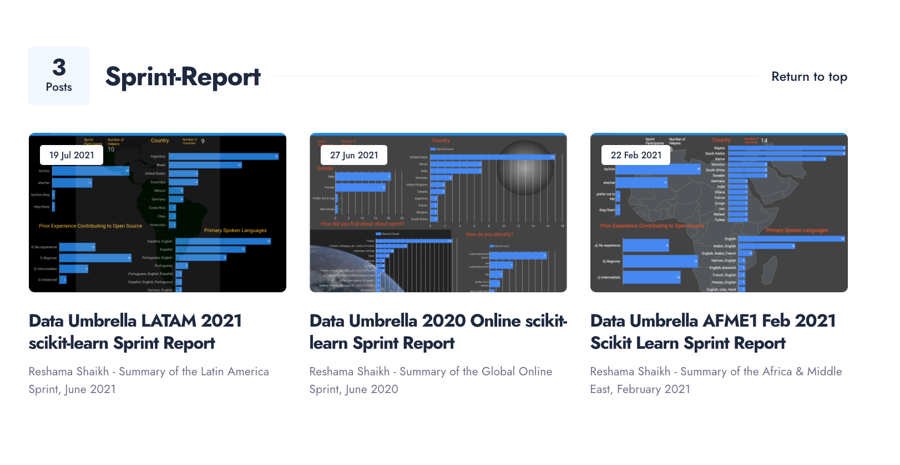
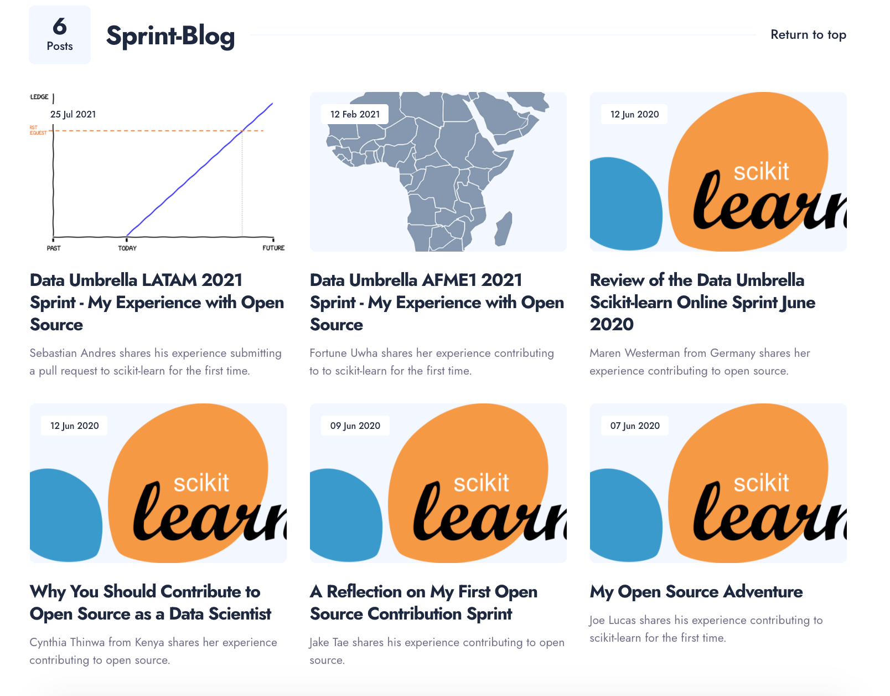

Author: [Reshama Shaikh](https://reshamas.github.io)  

## High Level Summary
- 40 participants
- 23/40 (57.5%) Returning contributors; 17/40 (42.5%) New contributors
- 17 countries represented

## Sprint Background
This sprint was organized by [Data Umbrella](https://www.dataumbrella.org) to increase the participation of underrepresented persons in data science, with a focus on the geographic regions of Africa & the Middle East (AFME).

The "sprint" is a hands-on hackathon where participants learn to contribute to scikit-learn, the most widely-used Python open source, machine learning library.  This sprint was a 4-hour block of time with pre- and post-sprint work required.

This report focuses on the summary, impact and lessons learned of the Data Umbrella [AFME2 scikit-learn sprint](https://afme2021rc.dataumbrella.org).  

<p float="left">
<a href="https://twitter.com/DataUmbrella/status/1451935870857121805">
   
</a>
</p>

<p float="left">
   <a href="https://afme2021rc.dataumbrella.org/">
  
</a>
</p>

## Event Sponsor

This event was funded in part by a grant from [Code for Science & Society](https://eventfund.codeforscience.org/), made possible by grant number [GBMF8449](https://www.moore.org/grant-detail?grantId=GBMF8449) from the [Gordon and Betty Moore Foundation](https://www.moore.org/).

<p float="left">
   <a href="https://eventfund.codeforscience.org/"> </a>
  
   <a href="https://www.moore.org/"></a>
   
</p>


## Sprint Agenda
- 09-Oct-2021:  Pre-sprint Kickoff (10am - 11am ET) (14:00 UTC)
- 23-Oct-2021:  Sprint (10am to 2pm ET) (14:00 UTC) 
- 06-Nov-2021:  Sprint Follow-up Office Hours (10am to 11am ET) (14:00 UTC)

<p float="left">
  
</p>

### Sprint Day
The sprint officially ran 4 hours, which is limited time to submit a PR.  The participants continued to work on their sprint PRs throughout the weekend.

### Follow-up Office Hours
Office hours were set up 2 weeks after the sprint where some of the scikit-learn core contributors were available to answer questions on open PRs.  


## Number of Attendees

- Pre-sprint Event: **9 people**
    - 2 organizers
    - 4 core developers
    -  **9 participants** (6 returning; 3 new)
- Sprint Day: **~40 people**
    - 3 organizers
    - 4 core developers
    - **40 participants** (23 returning; 17 new)
- Post-sprint Office Hours: **7 people**
    - 1 organizer
    - 2 core developers
    - **7 participants** (2 returning; 5 new)

## Pull Requests (PRs) Statistics

- 7 PRs were merged on sprint day
- 7 *additional* PRs were merged within 2 days of sprint day
- 33 PRs: a *total* of 33 PRs have been merged in the 4-week period of sprint day to date of report.

As of the date of this report (20-Nov-2021), there are 16 PRs open. Participants continued work on new issues after the sprint.

```github
is:pr #DataUmbrella is:open 
```
<p>
 
</p>


## Demographics ( * UPDATE)
Of the 74 people who applied, 40 attended. All applicants were accepted. This funnel graph shows the breakdown, by gender.

<iframe id="igraph" scrolling="no" style="border:none;" seamless="seamless" src="https://data-umbrella.github.io/images/2021-afme2/1_funnel.html" height="500" width="1000">
</iframe>	

A total of 40 contributors attended the sprint. 14 of 40 (35%) identified as she/her.  26 of 40 (65%) identified as he/him. 

<iframe id="igraph" scrolling="no" style="border:none;" seamless="seamless" src="https://data-umbrella.github.io/images/2021-afme2/2_pie_gender.html" height="500" width="1000">
</iframe>	


Contributors joined from **17 different countries**.  Country information was provided based on where participants were joining from. The countries with the most participants:  
1. Kenya: 11
1. United States of America: 5
1. India: 4
1. Saudi Arabia: 2
1. Germany: 2
1. Canada: 2
1. Bulgaria: 2
1. Argentina: 2

Other countries with 1 participant each include: Zambia, Venezuela, Sweden, South Africa, Poland, Lithuania, Kazakhstan, Ireland, Ghana, El Salvador.

<p>
<iframe id="igraph" scrolling="no" style="border:none;" seamless="seamless" src="https://data-umbrella.github.io/images/2021-afme2/barplot_country.html" height="1000" width="1000">
</iframe>	

</p>

## Invited Contributors

There were 4 invited contributors. Invited contributors were those who participated in a prior sprint and have continued contributing to scikit-learn.  

## Returning Contributors
This pie chart shows that of the 40 people attending, 57.5% were returning contributors.

<iframe id="igraph" scrolling="no" style="border:none;" seamless="seamless" src="https://data-umbrella.github.io/images/2021-afme2/3_pie_returning.html" height="500" width="1000">
</iframe>	

### Applications Received

This barplot shows all the countries from which applications were received. It also shows a breakdown of how many people attended from each country. 

<iframe id="igraph" scrolling="no" style="border:none;" seamless="seamless" src="https://data-umbrella.github.io/images/2021-afme2/bar_all_country.html" height="1000" width="1000">
</iframe>	


### Spoken Languages
The sprint was run in English. Participants were asked on their forms to indicate if they needed a translator. No translators were requested.

This barplot shows the primary spoken languages by the sprint participants.

<iframe id="igraph" scrolling="no" style="border:none;" seamless="seamless" src="https://data-umbrella.github.io/images/2021-afme2/spoken_languages.html" height="1000" width="1000">
</iframe>	

## Impact Report for Data Umbrella Scikit-learn Sprint

|                                       | Sprint 2021    |
|---------------------------------------|----------------|
| Report date                           | 20-Nov-2021    |
| Report author                          | Reshama Shaikh   |
| Sprint date                           | 23-Oct-2021    |
| Location                              | Online; Africa & Middle East (AFME2)         |
| Sprint website | [afme2021rc.dataumbrella.org](https://afme2021rc.dataumbrella.org) |
| Twitter | [Moment](https://twitter.com/i/events/1452292223463219205) |
| Open source library                   | [scikit-learn](https://github.com/scikit-learn/scikit-learn) |  
| GitHub repository link                | [data-umbrella/data-umbrella-scikit-learn-sprint](https://github.com/data-umbrella/data-umbrella-scikit-learn-sprint)| |
| Lead Organizer      | [Reshama Shaikh](https://twitter.com/reshamas)     |
| Assistant Organizers      | Mariam Haji, Cristina Mulas Lopez, Nestor Navarro |
| Lead Facilitator    | [Andreas Mueller](https://twitter.com/amuellerml) |
| Mentors / Translations | Not applicable  |  
| Scikit-learn core contributors    | Thomas Fan, Adrin Jalali, Olivier Grisel, Julien Jerphanon, Guillaume LeMaitre |  
| Teaching Assistants  | None |
| Community Contributors | Lucy Jimenez, Juan Martin Loyola |
| Platforms            | Discord & Zoom |
| Sponsor: | Grant [GBMF8449](https://www.moore.org/grant-detail?grantId=GBMF8449) from [Gordon and Betty Moore Foundation](https://www.moore.org) & [Code for Science and Society](https://eventfund.codeforscience.org)   |
|            |                |
| PULL REQUESTS **(PRs)**                 |          |
| PRs [MRG] at sprint  | 7      |
| PRs [MRG] post-sprint| 26+    (x)  |
| PRs open  | 16+        |
|           |          |
| Attendees:  Initial Registrations  | ~45  |
| Attendees:  Participated           | ~35  |
| Attendee List  | [Sprint Contributors](https://afme2021rc.dataumbrella.org/contributors)   |
|                                    |  |
| Post-sprint Survey  | [survey form] (closed) |
| Blog 1: Beryl Kanali| [My experience contributing to Open Source -AFME2 Oct 2021](https://medium.com/@kanaliberyl/my-experience-contributing-to-open-source-afme2-oct-2021-398a505e6d80) |


## Resources for Contributing to scikit-learn 
Because this was a virtual event and there is a limited capacity for being online for a full 8-hour day, a checklist was provided so folks could do preparation work at their own pace prior to the sprint.  [Resources for Prep Work](https://latam2021.dataumbrella.org/about/prep-work) are available on the sprint website.

A [Checklist](https://docs.google.com/document/d/1QknhXDJ4qtP8Co2SfqaPGaZ8J5grsMq08onxTXVvAFU/edit?usp=sharing) with highlighted notes to indicate updates from videos was also included.

## Impact


### Non-measurable Impact
Aside from the number of PRs that were merged, there is non-quantifiable impact of the open source sprint. Some examples include:
- learning to set up virtual environment
- using Git (fork, clone, branch, fetching another's PR)
- introduction to tests such as:  flake8 (linting, formatting), pytest, "continuous integration"
- navigating through the codebase structure of scikit-learn
- digging into functions, learning about errors
- learning about unit tests
- interacting with contributors on GitHub
- learning, in general
- networking
- building confidence (making a dent in "imposter syndrome")
- having fun

## Challenges

### Challenge 1: Outreach
Despite doing similar levels of outreach, for this sprint, we recieved about 50% of applications than we typically do.

This Google Analytics table shows that of the top 10 countries reached, 7 of them were in the region of Africa and Middle East. Despite Somalia being #4, we did not receive any applications from that country. 

Comparatively speaking, for our prior [Latin America sprint](), we had over 1100 users by the time the sprint report was written. For this event, it was about 50% of that.

<p float="left">
  
</p> 

<p float="left">
  
</p> 

### Challenge 2: [Preparation Work](https://afme2021rc.dataumbrella.org/about/prep-work)
Fewer participants in this sprint, compared to past sprints, did their preparation work. A few set up their working environment at the sprint, which results in having less time to work on an issue during the sprint.

One participant commented on the survey that the learning curve for Discord was high. However, the prep work includes watching a 10-minute video [Intro to Using Data Umbrella Discord Server](https://youtu.be/w2A8SknM-68).


### Challenge 3: Attrition and Impact on Pair Programming

Often with these events, there are no-shows at a rate of 20% to 30%. Pair programming is assigned prior to the sprint.  When a participant is a "no-show", this requires reassigning at the start of the sprint, which delays the start of the sprint.  Also, many participants are not proactive in communicating that their pair partner is absent.

Solution:  not sure what the solution to this is.

### Challenge 4: Internet Connectivity & Electrical Power Access

A number of participants joined intermittently and late due to access with internet connectivity or loss of power.


## Continued Contribution to Open Source
Participants were encouraged to keep contributing to scikit-learn or other Python libraries, using the skills learned in this event.

### Finding out about the sprint (update)
For those who attended the sprint, this is how they learned of the event. The main avenues were Twitter, LinkedIn and their network ("word of mouth").

<p float="left">
  
</p>

### Videos
Based on feedback from our last sprint, [Latin America 2021](https://blog.dataumbrella.org/data-umbrella-latam-2021-scikit-learn-sprint-report), we created a video demonstrating how to use Visual Studio LiveShare.

<p><iframe src="https://www.youtube.com/embed/WHOiljOYGVw" loading="lazy" frameborder="0" allowfullscreen></iframe></p>

### Language Translations
No new language translations were created for this sprint.


## Adjustments for Next Sprint

### Returning Contributors
Returning contributors are already in the sprint category on Discord.  Work out a process where returning contributors can sign up for the sprint without going through entire application process.

### Returning Contributors Working Offline
We received a few requests from past participants to work on issues outside of the sprint day due to schedules. We accommodated that request and they were given access to the curated issues list to work on as their schedule permitted.

### Second Co-author on Pull Request
Add in documentation on how to include a second author on pull request commits.

## Sprint Feedback

Feedback has been shared a number of ways:  
- Twitter [Moment](https://twitter.com/i/events/1452292223463219205)
- Blogs
- Sprint survey
- Social media (LinkedIn)
- Casually, in conversation during the sprint, pre-sprint and post-sprint events

## Data Umbrella Feedback Survey

Respondents rated their overall sprint experience highly favorably and had a positive experience working with their pair programming partner.  

### Language
The survey form was in English.

### Response Rate
The survey response rate was 19/40 = 47.5%

### Favorite Parts About the Sprint

In response to the question "*What are your favorite parts about the sprint?*"  

- *Pair programming and the support from the core developers*
- *Meeting new people and asking the core-developers about issues in our PRs.*
- *Pair programming. Ability to interact with scikit learn core contributors.*
- *Pair Programming*
- *Very quick responses from senior contributors*
- *I learned a lot, met new people and got a lot of help from the core developers and got to debug things with people.*
- *The actual sprint day*
- *The fact we could ask for help in real time from the sklearn contributors team, amazing stuff!*
- *Working on scikit-learn issues with pair programming partner*
- *The opportunity to connect with core maintainers; reasonable time commitment*
- *Hanging out before the sprint and working together*
- *Working with a new person and tackling an intermediate issue.*
- *Learning new things and meeting new people.*
- *Finding a community, getting to meet the sklearn core devs, working together on a contribution*
- *It was great. Thank you for organizing it.*
- *Interact with diverse members of the team from different countries.*
- *It was perfect! Thank you for organizing one.*

### Suggestions for Improvement

In response to the question "*What could have worked better at the sprint?*"  

- *I wish I knew about how to co-author before committing!*
- *Discord has a bit of a learning curve...*
- *Maybe a bit more background information on the issue would have been useful. For example why is it an issue, why are the changes necessary, any pertinent guidelines on the scikitlearn best practices, what errors we could expect and general guidelines on how to go about fixing. Of course not all off this information might be known in advance but any background available is always useful :)*
- *You should do sprints more frequently!*
- *I think we should have a mechanism in place for putting people that are alone together with existing pairs. Having three people together seems better to me than having some people alone due to internet issues or partners not showing up.*
- *More time to work on issues.*
- *Since we are doing everything on Discord, we could also have the kick off meetings on Discord as well. Just makes it easier to attend everything, without having to track different links. But it is just a minor thing, and some people do prefer zoom so there's that.*
- *I would have liked to engage more with others, besides my pair programming partner. This way I can easier find somebody to work on in issue beyond the actual event. Maybe improve on the introduction during the zoom meeting to have people interact more relaxed, share things.*

#### Other Feedback from Survey
 
In response to the question "*Include any other thoughts here.*"  

- *This was such an amazing learning experience, especially considering the actual time investment. I hope to continue contributing and to be able to advance to more complex issues along the way.*
- *I hope that when all the pandemic thing is left behind, and we can return to meeting in person, we keep a couple of virtual sprints thus people like me can attend ^^*
- *I found it very useful that my pair programming partner pushed me to ask for help on the channel. I think if we haven't done that I probably would have ended up frustrated and not solving the problems.*
- *I hope more sprints will be organised.*


## Sprint:  Social Media

### Sprint Kickoff
<p>
<blockquote class="twitter-tweet"><p lang="en" dir="ltr">The Africa &amp; Middle East (AFME) <a href="https://twitter.com/hashtag/ScikitLearnSprint?src=hash&amp;ref_src=twsrc%5Etfw">#ScikitLearnSprint</a> has kicked off!<a href="https://twitter.com/hashtag/python?src=hash&amp;ref_src=twsrc%5Etfw">#python</a> <a href="https://twitter.com/hashtag/datascience?src=hash&amp;ref_src=twsrc%5Etfw">#datascience</a> <a href="https://twitter.com/hashtag/machinelearning?src=hash&amp;ref_src=twsrc%5Etfw">#machinelearning</a> <a href="https://twitter.com/hashtag/oss?src=hash&amp;ref_src=twsrc%5Etfw">#oss</a><br>Wonderful to see returning &amp; new contributors!<br><br>Thank you to <a href="https://twitter.com/codeforsociety?ref_src=twsrc%5Etfw">@codeforsociety</a> &amp; <a href="https://twitter.com/MooreFound?ref_src=twsrc%5Etfw">@MooreFound</a> for your support. <a href="https://t.co/g7zVivJpPR">pic.twitter.com/g7zVivJpPR</a></p>&mdash; Data Umbrella (@DataUmbrella) <a href="https://twitter.com/DataUmbrella/status/1451935870857121805?ref_src=twsrc%5Etfw">October 23, 2021</a></blockquote> <script async src="https://platform.twitter.com/widgets.js" charset="utf-8"></script>
</p>

### First PR Merged!
<p>
<blockquote class="twitter-tweet"><p lang="en" dir="ltr">Reference:<a href="https://t.co/Q5WqVVV0Py">https://t.co/Q5WqVVV0Py</a></p>&mdash; Data Umbrella (@DataUmbrella) <a href="https://twitter.com/DataUmbrella/status/1451935999328768019?ref_src=twsrc%5Etfw">October 23, 2021</a></blockquote> <script async src="https://platform.twitter.com/widgets.js" charset="utf-8"></script>
</p>


### [Fortune](https://www.linkedin.com/posts/fortune-uwha_opensource-scikitlearn-python-activity-6858826207018921984--V5D/) of Nigeria / Lithuania

<p float="left">
<a href="https://www.linkedin.com/posts/fortune-uwha_opensource-scikitlearn-python-activity-6858826207018921984--V5D/">
   
</a>
</p>

### Giancarlo of El Salvador
<p>
<blockquote class="twitter-tweet"><p lang="en" dir="ltr">There&#39;s no better way to actually start contributing to open source than a sprint on Scikit-learn 🤭 <a href="https://t.co/0vXEE7dyL1">https://t.co/0vXEE7dyL1</a></p>&mdash; Giancarlo Pablo (@gpablo06) <a href="https://twitter.com/gpablo06/status/1451963803600576520?ref_src=twsrc%5Etfw">October 23, 2021</a></blockquote> <script async src="https://platform.twitter.com/widgets.js" charset="utf-8"></script>
</p>

### MA of India
<p>
<blockquote class="twitter-tweet"><p lang="en" dir="ltr">My first (and second) open source contribution at <a href="https://twitter.com/scikit_learn?ref_src=twsrc%5Etfw">@scikit_learn</a>. What an evening it turned out to be. Didn&#39;t know it would go so smoothly. Thank you <a href="https://twitter.com/DataUmbrella?ref_src=twsrc%5Etfw">@DataUmbrella</a> <br>Great working with you <a href="https://twitter.com/miwojcz?ref_src=twsrc%5Etfw">@miwojcz</a>. See you again in the future sprints 😃<a href="https://twitter.com/hashtag/OpenSource?src=hash&amp;ref_src=twsrc%5Etfw">#OpenSource</a> <a href="https://twitter.com/hashtag/ScikitLearnSprint?src=hash&amp;ref_src=twsrc%5Etfw">#ScikitLearnSprint</a> <a href="https://t.co/bo5W6rcLnR">https://t.co/bo5W6rcLnR</a></p>&mdash; Mohammad A. (@ma_jauhar) <a href="https://twitter.com/ma_jauhar/status/1451967112222629892?ref_src=twsrc%5Etfw">October 23, 2021</a></blockquote> <script async src="https://platform.twitter.com/widgets.js" charset="utf-8"></script>
</p>

### Hannah of Germany
<p>
<blockquote class="twitter-tweet"><p lang="en" dir="ltr">Thank you for making this great sprint happen <a href="https://twitter.com/reshamas?ref_src=twsrc%5Etfw">@reshamas</a> and <a href="https://twitter.com/DataUmbrella?ref_src=twsrc%5Etfw">@DataUmbrella</a>! It was so much fun! <a href="https://twitter.com/hashtag/OpenSource?src=hash&amp;ref_src=twsrc%5Etfw">#OpenSource</a> <a href="https://twitter.com/hashtag/sklearn?src=hash&amp;ref_src=twsrc%5Etfw">#sklearn</a> <a href="https://twitter.com/hashtag/womenintech?src=hash&amp;ref_src=twsrc%5Etfw">#womenintech</a> <a href="https://t.co/YGBrQmj0ib">https://t.co/YGBrQmj0ib</a></p>&mdash; Hannah Bohle (@HannahBohle) <a href="https://twitter.com/HannahBohle/status/1451972342066958337?ref_src=twsrc%5Etfw">October 23, 2021</a></blockquote> <script async src="https://platform.twitter.com/widgets.js" charset="utf-8"></script>

</p>

### Maren of Germany
<p>
<blockquote class="twitter-tweet"><p lang="en" dir="ltr">Having fun with <a href="https://twitter.com/HannahBohle?ref_src=twsrc%5Etfw">@HannahBohle</a> at the <a href="https://twitter.com/hashtag/ScikitLearnSprint?src=hash&amp;ref_src=twsrc%5Etfw">#ScikitLearnSprint</a> organised by <a href="https://twitter.com/DataUmbrella?ref_src=twsrc%5Etfw">@DataUmbrella</a>. We&#39;re very honoured to be part of this sprint. 😊🎉🥳 <a href="https://twitter.com/hashtag/opensource?src=hash&amp;ref_src=twsrc%5Etfw">#opensource</a> <a href="https://twitter.com/hashtag/womenintech?src=hash&amp;ref_src=twsrc%5Etfw">#womenintech</a> <a href="https://t.co/uaxtQLNFmP">pic.twitter.com/uaxtQLNFmP</a></p>&mdash; Maren Westermann (@MarenWestermann) <a href="https://twitter.com/MarenWestermann/status/1451983188105039874?ref_src=twsrc%5Etfw">October 23, 2021</a></blockquote> <script async src="https://platform.twitter.com/widgets.js" charset="utf-8"></script>
</p>

### Fortune of Nigeria
<p>
<blockquote class="twitter-tweet"><p lang="en" dir="ltr">Another scikit-learn sprint!😀. Super excited to be a part of this again and experience the fun and challenges of contributing to open source:)). Many thanks to <a href="https://twitter.com/DataUmbrella?ref_src=twsrc%5Etfw">@DataUmbrella</a>, <a href="https://twitter.com/MooreFound?ref_src=twsrc%5Etfw">@MooreFound</a> ,<a href="https://twitter.com/codeforsociety?ref_src=twsrc%5Etfw">@codeforsociety</a> for the opportunity.<a href="https://twitter.com/hashtag/opensource?src=hash&amp;ref_src=twsrc%5Etfw">#opensource</a> <a href="https://twitter.com/hashtag/ScikitLearnSprint?src=hash&amp;ref_src=twsrc%5Etfw">#ScikitLearnSprint</a> <a href="https://twitter.com/hashtag/python?src=hash&amp;ref_src=twsrc%5Etfw">#python</a> <a href="https://t.co/CI1PGbCvLP">https://t.co/CI1PGbCvLP</a></p>&mdash; Fortune Uwha🦋 (@fortune_uwha) <a href="https://twitter.com/fortune_uwha/status/1452018164796203019?ref_src=twsrc%5Etfw">October 23, 2021</a></blockquote> <script async src="https://platform.twitter.com/widgets.js" charset="utf-8"></script>
</p>

### Tia of Zambia
<p>
<blockquote class="twitter-tweet"><p lang="en" dir="ltr"><a href="https://twitter.com/DataUmbrella?ref_src=twsrc%5Etfw">@DataUmbrella</a> gave me the opportunity to attend my first scikit-learn sprint, ever!!! Contributing to this open source library was fun and very educational! - Bonus✨<br><br>Lesson - THE PREP WORK AT ANY SPRINT IS IMPORTANT!! <a href="https://twitter.com/hashtag/Python?src=hash&amp;ref_src=twsrc%5Etfw">#Python</a> <a href="https://twitter.com/hashtag/MachineLearning?src=hash&amp;ref_src=twsrc%5Etfw">#MachineLearning</a></p>&mdash; Tia (@lontia_nkhuwa) <a href="https://twitter.com/lontia_nkhuwa/status/1454314039790682114?ref_src=twsrc%5Etfw">October 30, 2021</a></blockquote> <script async src="https://platform.twitter.com/widgets.js" charset="utf-8"></script>

</p>

---

## Social Media Promotion

### Twitter (English)
<blockquote class="twitter-tweet"><p lang="en" dir="ltr">📣Join us for our <a href="https://twitter.com/hashtag/ScikitLearnSprint?src=hash&amp;ref_src=twsrc%5Etfw">#ScikitLearnSprint</a> <br>👉🏽with a focus on Africa &amp; Middle East (AFME)<br><br>🗓️23-Oct-2021<br>🕙 5pm to 9pm EAT<br>🏢 Online<a href="https://twitter.com/hashtag/python?src=hash&amp;ref_src=twsrc%5Etfw">#python</a> <a href="https://twitter.com/hashtag/datascience?src=hash&amp;ref_src=twsrc%5Etfw">#datascience</a> <a href="https://twitter.com/hashtag/oss?src=hash&amp;ref_src=twsrc%5Etfw">#oss</a> <br>Thank you to our sponsors: <a href="https://twitter.com/codeforsociety?ref_src=twsrc%5Etfw">@codeforsociety</a> &amp; <a href="https://twitter.com/MooreFound?ref_src=twsrc%5Etfw">@MooreFound</a><br><br>Details on application: <a href="https://t.co/UyIoQ9gS2G">https://t.co/UyIoQ9gS2G</a> <a href="https://t.co/o9C4PpGg5m">pic.twitter.com/o9C4PpGg5m</a></p>&mdash; Data Umbrella (@DataUmbrella) <a href="https://twitter.com/DataUmbrella/status/1435972074842034184?ref_src=twsrc%5Etfw">September 9, 2021</a></blockquote> <script async src="https://platform.twitter.com/widgets.js" charset="utf-8"></script>


## Past Data Umbrella Sprint Reports

<p float="left">
<a href="https://blog.dataumbrella.org/tags/#sprint-report">
   
</a>
</p>

## Past Data Umbrella Sprint Participant Blogs

<p float="left">
<a href="https://blog.dataumbrella.org/tags/#sprint-blog">
   
</a>
</p>

---

## Acknowledgments
- All the [scikit-learn core contributors](https://scikit-learn.org/stable/about.html) who mentored at the sprint and those who were online during the weekend afterwards to promptly review the submitted pull requests.

---

## References

## Past Sprint Reports & Blogs by Contributors
- Data Umbrella scikit-learn [Sprint Reports](https://blog.dataumbrella.org/tags/#sprint-report)
- Past Sprints [Blogs by Contributors](https://blog.dataumbrella.org/tags/#sprint-blog)

### Upcoming Sprints
- [List of Upcoming scikit-learn Sprints](https://github.com/scikit-learn/scikit-learn/wiki/Upcoming-events)

### Past Sprints
- [List of Past scikit-learn Sprints](https://github.com/scikit-learn/scikit-learn/wiki/Past-sprints) (scikit-learn wiki)
- [List of scikit-learn Sprints](https://reshamas.github.io/resources/scikit_learn_sprints/) (compiled by Reshama Shaikh)
- [scikit-learn Sprints Organized by Reshama Shaikh](https://www.dataumbrella.org/open-source/sprints)

#### Code Snippets for Searching GitHub PRs

Data Umbrella PRs from Sprint Day and Later
```
is:pr #DataUmbrella is:closed sort:updated-desc pr:created:>=2021-10-23 
```

PRs created on sprint day, then sort
```github
is:pr #DataUmbrella created:2021-10-23 sort:updated-desc 
```

---
## Addendum
- [no addendums or updates at the time of publication]
