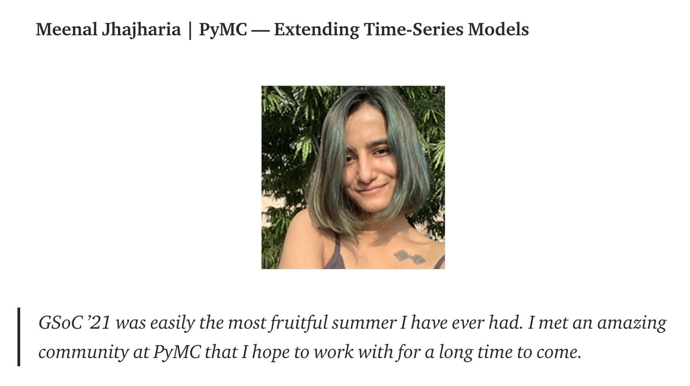

Authors:  [Reshama Shaikh](https://reshamas.github.io), [Oriol Abril Pla](https://oriolabrilpla.cat), [Meenal Jhajharia](https://mjhajharia.com), [Thomas Wiecki](https://www.pymc-labs.io/team/thomas-wiecki/)

## About the Data Umbrella PyMC Sprint

Data Umbrella and PyMC organized their first collaborative sprint in February 2022.  The  sprint event was preceded by a series of webinars and [videos](​​https://www.youtube.com/playlist?list=PLBKcU7Ik-ir99uTvN0315hIVLuyj4Q1Gt) by maintainers of the PyMC library in January and February 2022:  
- [Intro to Probabilistic Programming with PyMC](https://youtu.be/Qu6-_AnRCs8) (Austin Rochford)
- [Contributing to PyMC Documentation](https://youtu.be/fzpmLWQNj4A) (Oriol Abril Pla)
- [My Experience Contributing to PyMC](https://youtu.be/Iq0dY5hU4D4) (Ricardo Vieira)
- [An Example Pull Request to PyMC](https://youtu.be/NbmdFJsnuuo) (Reshama Shaikh)
- [Intro to NumPy Operations](https://youtu.be/oud3Jd1FJ7c) (Meenal Jhajharia)

The lead sprint organizers on the PyMC team were Meenal Jhajharia (India) and Oriol Abril Pla (Helsinki, Finland), and the leads for the Data Umbrella team were Reshama Shaikh (New York, NY, USA) and Beryl Kanali (Nairobi, Kenya).  It was truly an international endeavor!

   

2022 is a special year for the PyMC project due to the [beta release of the next major version](https://www.pymc.io/blog/pymc3_vs_pymc_v4.html) of the library: 4.0.

## Sprint Background

PyMC Maintainer Oriol Abril Pla had learnt of Reshama Shaikh when he was doing diversity research in the PyData ecosystem in his role as Diversity Chair of [PyMCon 2020](https://pymc-devs.github.io/pymcon/).  He had heard of Reshama’s work on the [NumFOCUS DISC Committee](https://reshamas.github.io/reflecting-on-two-years-on-the-numfocus-disc-committee/).  That led him to Data Umbrella where he connected with the organizers on their Discord server in August 2020. In March of 2021, Data Umbrella invited Oriol to present to the Data Umbrella community.  That event was the webinar [Bayesian Modeling with PyMC3
](https://youtu.be/6dc7JgR8eI0).  That was the start of a fruitful relationship between the two organizations. 

The sprint was initiated by Meenal of the PyMC team in September of 2021.  Meenal had recently completed [Google Summer of Code, 2021](https://mjhajharia.com/post/2021/08/20/summing-up-summer/). Her project was entitled [PyMC: Extending Time-Series Models](https://numfocus.medium.com/45-gsoc-students-contributed-to-numfocus-projects-aeaebcbab339).  

   

 
The PyMC team was interested in having the sprint event for various reasons:  
- To connect with and to involve more of the community with this outreach initiative
- To attract new contributors
- To build community
- To welcome newcomers in the field

Meenal shares:
>We hoped to create a space for newcomers to Bayesian statistics or probabilistic programming to get a chance to dip their toes and to facilitate their first contributions to open source and specifically, with PyMC by providing guidance.

Oriol’s purpose of the sprint was to reach outside the immediate circle of users to an extended community:  
>PyMC is a library for Bayesian modeling, something that is generally not taught until MSc level due to popularity and historical reasons. This adds an extra wall to overcome in addition to other societal problems (if compared to similar libraries). I hoped that the sprint, combined with the documentation improvements would show a path so people know what to do and have easy access to all necessary resources to learn PyMC and Bayes and eventually become a contributor.

## Goals of the Sprint

The PyMC maintainers had a number of outcomes they had hoped to achieve by holding this sprint.  They wanted to provide an on-ramp that would attract and support new contributors who may potentially become returning contributors. The project team also wanted more people in the community to be introduced and become familiar *generally* with probabilistic programming, open source and documentation in large libraries.  And the team wanted *specifically* for the community to become acquainted with PyMC and Bayesian methods and pique their interests.

Oriol created [extensive documentation](https://pymc-data-umbrella.xyz/en/latest/webinars/index.html) to facilitate onboarding new contributors with ease.  This newly created dossier was also intended for current contributors as well as maintainers to expand their knowledge of PyMC project, its documentation,  its codebase and with the latest version 4, as it was a significant change. This was also expected to increase the discourse and interaction amongst the PyMC team.

The team also put together a series of presentations by library maintainers which are available on YouTube, with the intention of having these resources available beyond the sprint event.

## Sprint Days
The [PyMC sprint schedule](https://pymc-data-umbrella.xyz/en/latest/sprint/index.html) was:
- February 11: Pre-sprint Office Hours (1 hour)
10-15 attendees
- February 18: Sprint Day 1 (2 hours) (North & South America)
10-15 attendees
- February 19: Sprint Day 2 (2 hours) (Africa, Europe, Mideast, Asia)
8-10 attendees
- February 25: Post-sprint Office Hours (1 hour)
8-10 attendees

Participants joined from India, USA, Argentina, Kenya, Germany and Taiwan.

## Observed Outcomes

The series of videos on YouTube has garnered much interest!  Austin Rochford’s talk has surpassed 2000 views in 3 months.  This encouraged him to write a blog, [A Modern Introduction to Probabilistic Programming with PyMC](https://austinrochford.com/posts/intro-prob-prog-pymc.html). The reach of these webinars and videos has been amazing, and that energy has inspired and motivated other maintainers to become active.  It brought to light what an untapped market exists for this project.  

The team has seen new contributors to the library since the sprint.

Sandra Meneses joined the PyMC sprint from Berlin, and she attended both sprint sessions.
Sandra worked on [Adding a pre-commit check for docs cross-references
](https://github.com/pymc-devs/pymc/pull/5486).  A pre-commit check ensures that internal links and links to other python libraries are generated with sphinx cross-references and not copying urls manually.  This is important because PyMC docs are built for multiple versions; manual links must specify the version to work whereas sphinx cross references are converted to links at build time so they always point to the version being built, keeping the docs coherent. Moreover, sphinx cross-references are also converted to working links if generating a pdf version of the documentation and are much more robust, if a dependency restructures the documentation changing some of the urls (or changes the base url) we only need to rebuild the docs (and change a single line if the base url was modified), not search for all occurrences and update them"
Her pull request was a significant contribution because it will have a huge impact on the library by reducing documentation requirements and easing maintenance work.  

Maintainer Oriol states that Sandra’s pull request required expertise that is not held by everyone on the contributor team.  Read more about [Sandra’s first time contributing to PyMC](https://blog.dataumbrella.org/sandra-sprints).

   

There were new contributors that expressed interest in applying for
[Google Summer of Code](https://summerofcode.withgoogle.com/programs/2022/organizations/numfocus) projects with PyMC.

The expanded visibility of PyMC and the subsequent interest has been apparent in increased GitHub ([pymc](https://github.com/pymc-devs/pymc)) and Twitter ([@pymc_devs](https://twitter.com/pymc_devs)) followers.

There were several new contributors to PyMC who had not heard of PyMC prior to the sprint, and they enjoyed their experience contributing.  There was increased involvement by prior contributors in docs as a result of Oriol’s tutorial webinar, [Contributing to PyMC Documentation](https://www.youtube.com/watch?v=fzpmLWQNj4A&list=PLBKcU7Ik-ir99uTvN0315hIVLuyj4Q1Gt&index=6), which provided a valuable resource.  

It is not apparent that sprint participants have continued contributing to PyMC after the sprint.

The most important change has been energizing the community and starting the [PyMC Community Office Hours](https://discourse.pymc.io/tag/office-hours).

## Community Feedback on the Sprint

Anonymous:

   

#### Kimbo Chen feedback

   

## Acknowledgments

We would like to thank all the following for their support in running the sprint:  
- [PyMC Team](https://pymc-data-umbrella.xyz/en/latest/about/index.html)
- NumFOCUS
- [Sandy Weng](https://www.linkedin.com/in/sandy-weng-a0959762/) of Data Umbrella: for assisting in marketing
- [CZI Grant](https://blog.dataumbrella.org/czi-grant-press) supporting Data Umbrella
- Google Summer of Code

## About PyMC & Data Umbrella

[Data Umbrella](https://www.dataumbrella.org) is a global community for underrepresented persons in data science.  It is a fiscally hosted project of Open Collective, a registered 501(c)(3) non-profit based in California, USA. Data Umbrella: organizes online speaker series on data science and open source, organizes sprints / hackathons, curates resources on inclusive practices.  All levels are welcome, beginners and experts.

[PyMC](https://docs.pymc.io/en/latest/#) is a probabilistic programming package for Python that allows users to fit Bayesian models using a variety of numerical methods, most notably Markov chain Monte Carlo (MCMC) and variational inference (VI). Its flexibility and extensibility make it applicable to a large suite of problems.  PyMC is a non-profit project under NumFOCUS.
