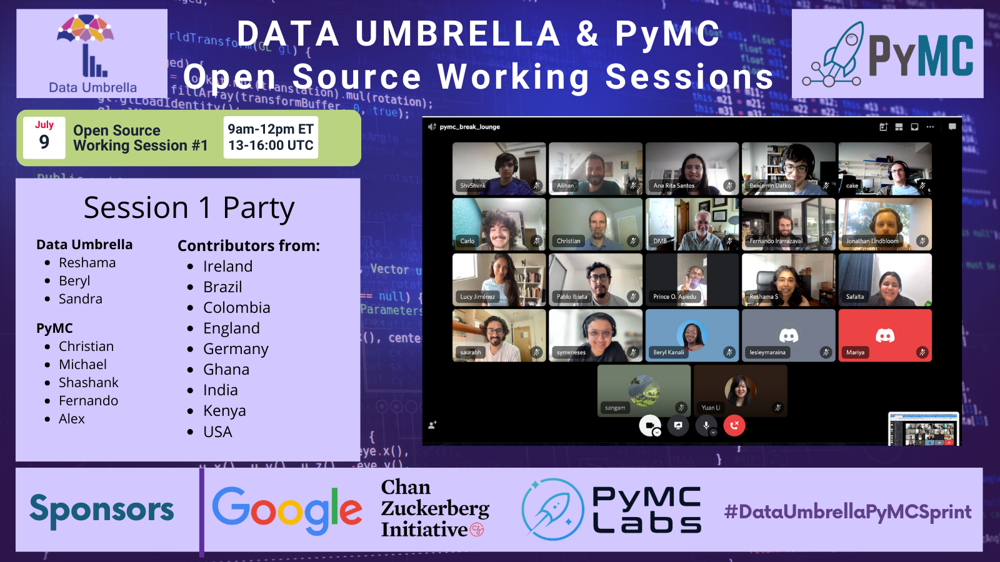
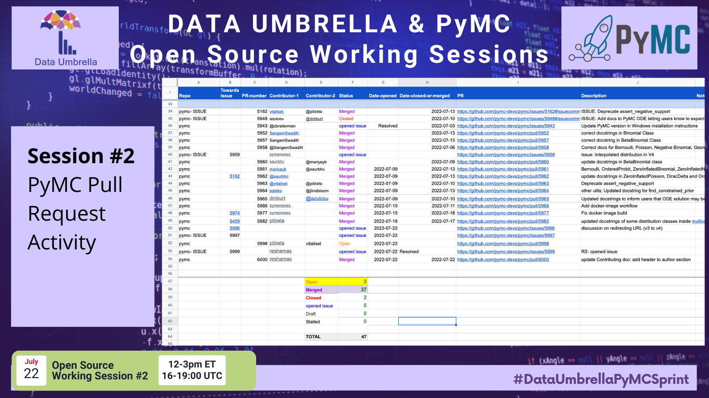
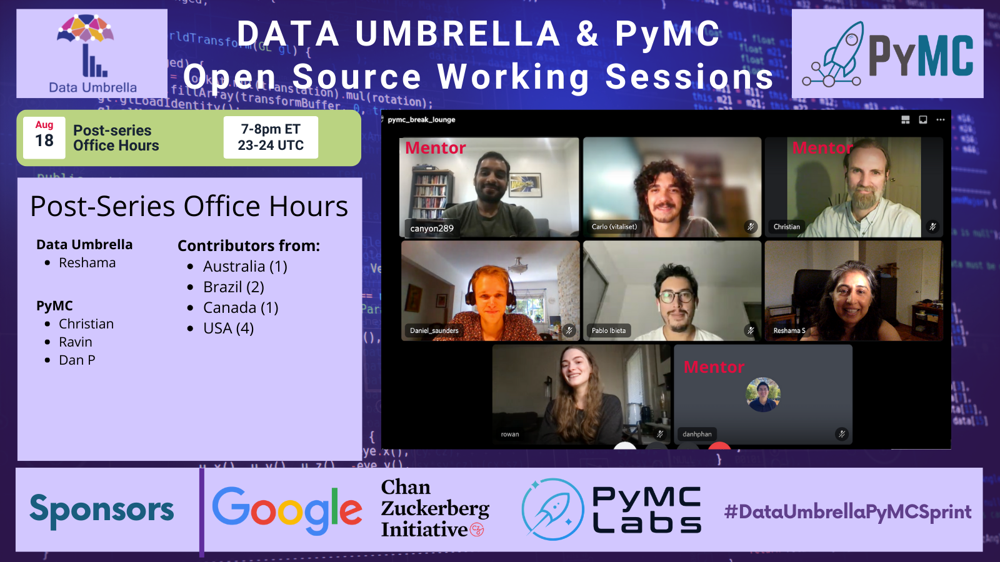
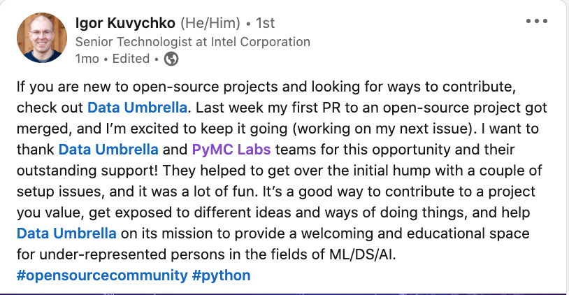

Author: [Reshama Shaikh](https://reshamas.github.io)  

## High Level Summary
Number of participants who:  
- Registered: 76
- Attended:  38
- Submitted >= 1 pull request:  24
- Countries represented: 10

   
  

## Background
The PyMC open source working sessions were organized by [Data Umbrella](https://www.dataumbrella.org) to increase the participation of underrepresented persons in open source, python and data science.

This report focuses on the summary, impact and lessons learned of the Data Umbrella [PyMC Open Source Working Sessions](https://pymc-data-umbrella.xyz/en/latest/2022-07_sprint/schedule.html).  

## Event Sessions

A series of 3 separate working sessions were organized, plus pre and post event office hours. Participants were paired with another person with whom they could work during the working sessions.

The office hours provided a casual, unstructured space for participants to introduce themselves and ask any questions.

The 3 working sessions were scheduled at different days of the week and times in order to provide options for folks in the community to attend who had varying schedules.

The intention was that some participants would be able to attend multiple sessions to build experience in contributing.  Some participants attended more than one session, and two participants attended all 3 sessions and both office hours.

### Pre-Series Office Hours

Photo not available.

### Session 1

   
   
   
  

### Session 2

   
   
   
  
   
   

### Session 3

   
   

### Post-Series Office Hours

   
   

## Event Sponsors

This event was supported by:  
- [Google Open Source](https://opensource.google/)
- [Chan Zuckerberg Initiative](https://chanzuckerberg.com/science/programs-resources/open-science/communitiesofpractice/data-umbrella/) (2-year [Communities of Practice](https://chanzuckerberg.com/science/programs-resources/open-science/communitiesofpractice/data-umbrella/) grant)
- [PyMC Labs](https://www.pymc-labs.io/)

   
  

This is a 3-minute video by Mariatta Wijaya of Google with inspirational tips on contributing to open source.

<iframe src="https://www.youtube.com/embed/NpWdYEp8-u4" loading="lazy" frameborder="0" allowfullscreen></iframe>

## [Schedule of Sessions](https://pymc-data-umbrella.xyz/en/latest/2022-07_sprint/index.html)
- 02-Jul-2022: Pre-series Office Hours (13-14:00 UTC) (1 hr)
- 09-Jul-2022: Session #1 (13-16:00 UTC) (3 hrs)
- 22-Jul-2022: Session #2 (16-19:00 UTC) (3 hrs)
- 4/5-Aug-2022: Session #3 (23-2:00 UTC) (3 hrs)
- 18-Aug-2022: Post-series Office Hours (23-24:00 UTC) (1hr)

We varied the [schedule of working sessions](https://docs.google.com/spreadsheets/d/1oO9OhsTh9PFcqKI7Exj_ZcH0GvunQVHtM4aqUh0kjTk/edit?usp=sharing) to accommodate participants from different regions and time zones.

 

## Number of Attendees

| Session                  | Data Umbrella Organizers | PyMC Mentors | Community Contributors | Note   |
|--------------------------|--------------------------|--------------|------------------------|--------------|
| Pre-series Office Hours  | 3                        | 2            | 24                     | |
| Session #1               | 3                        | 4            | 20                     | |
| Session #2               | 3                        | 4            | 12                     | |
| Session #3               | 1                        | 4            | 6                      | Asia-Pacific (a)|
| Post-series Office Hours | 1                        | 3            | 4                      |Asia-Pacific(a)| 
|

(a) Session 3 and post-series office hours were for Asia-Pacific time zone.

## Event Participants
We used a Sphinx website whose source code was publicly available.  We provided instructions on how participants could add their information to the website. Participants had the *option* to add their name, photo and other information to the [event website as contributors](https://pymc-data-umbrella.xyz/en/latest/2022-07_sprint/sprint_parties/contributors.html). For some participants, adding their information was a milestone because they were working Git, GitHub, sphinx and submitting a pull request for the first time.

## Contributions Statistics

The contributions during the working sessions were tracked in this [PyMC OS-WS spreadsheet](https://docs.google.com/spreadsheets/d/11aUZN_iqPF4-oWNvFKhkPIMYLizVE_EmoHugX7kGgHY/edit?usp=sharing).  Contributions included both submitting a pull request and opening an issue where observed. 

We worked on a few different repositories for the PyMC project:  
1. [video-timestamps](https://github.com/pymc-devs/video-timestamps): this is a beginner-friendly [list of issues](https://github.com/pymc-devs/video-timestamps/issues/11) where contributors watch a video from the PyMCon 2022 conference and add timestamps
1. [pymc-data-umbrella](https://github.com/pymc-devs/pymc-data-umbrella/pull/128): this is the event website. Contributors could submit PRs to fix typos or clarify the contributing guide, as well as add their information to the [list of participants](https://pymc-data-umbrella.xyz/en/latest/2022-07_sprint/sprint_parties/contributors.html)
1. [pymc-dev/pymc](https://github.com/pymc-devs/pymc): this is the main code repository for PyMC
1. [pymc-dev/pymc-examples](https://github.com/pymc-devs/pymc-examples): this is the repo that holds notebook examples for PyMC

As of the date of this report (28-Aug-2022), these are the PR stats:  
- Open: 2 
- Merged: 56
- Issues opened: 6  

#### Timestamps

Timestamps were added for 16 videos.

 

#### Event website

A number of PRs were submitted to update contributor information.

 

#### Updating Jupyter Notebooks

This was a more intermediate issue for new contributors, which was updating notebooks with consistent information for sphinx rendering. 

 

#### PyMC documentation

These contributions were in the main code repository.

 

## Demographics
Of the 74 people who registered, 38 attended. Of the 38 who attended, 24 submitted a pull request. This funnel graph shows the breakdown, by gender.

<iframe id="igraph" scrolling="no" style="border:none;" seamless="seamless" src="https://data-umbrella.github.io/images/2022-pymc/plotly/funnel.html" height="500" width="1000">
</iframe>	

A total of 38 contributors attended at least one event of the working sessions, including office hours. 14 of 38 (37%) identified as she/her.  24 of 38 (63%) identified as he/him. 

<iframe id="igraph" scrolling="no" style="border:none;" seamless="seamless" src="https://data-umbrella.github.io/images/2022-pymc/plotly/gender.html" height="500" width="1000">
</iframe>	

Contributors joined from **10 different countries**.  Country information was provided based on where participants were joining from.  
1. United States of America: 13
1. India: 6
1. Ghana: 4
1. Kenya: 4
1. Germany: 3
1. United Kingdom: 2
1. Canada: 2
1. Brazil: 2
1. Colombia: 1
1. Ireland: 1

<iframe id="igraph" scrolling="no" style="border:none;" seamless="seamless" src="https://data-umbrella.github.io/images/2022-pymc/plotly/country.html" height="1000" width="1000">
</iframe>

## Returning Contributors
There were 3 ["returning"](https://pymc-data-umbrella.xyz/en/latest/2022-07_sprint/sprint_parties/contributors.html#returning-contributors) contributors.  These contributors had participated in a previous *scikit-learn* sprint.

### Spoken Languages
The event was run in English. Participants were asked on their registration forms to indicate if they needed a translator. No translators were requested.

We had a channel for `#espanol_chat` which was utilized at a session when there was a Spanish-speaking mentor and participants from Latin America.

This barplot shows the primary spoken languages by the participants.

<iframe id="igraph" scrolling="no" style="border:none;" seamless="seamless" src="https://data-umbrella.github.io/images/2022-pymc/plotly/primary_spoken_language.html" height="1000" width="1000">
</iframe>	

## Impact Report for Data Umbrella PyMC Open Source Working Sessions

### Non-measurable Impact
Aside from the number of PRs that were merged and issues that were opened, there is non-quantifiable impact of the open source working sessions. Some examples include:
- learning to set up virtual environment
- using Git (fork, clone, branch, fetching another's PR)
- introduction to tests such as:  flake8 (linting, formatting), pytest, "continuous integration"
- learning about sphinx and documentation
- learning about `numpydoc` validation
- navigating through the codebase structure of pymc
- digging into functions, learning about errors
- interacting with contributors on GitHub
- learning, in general
- networking, meeting people from around the world
- building confidence (making a dent in "imposter syndrome")
- having fun

### Finding out About the Working Sessions

We collaborated with a group of [Community Partners](https://pymc-data-umbrella.xyz/en/latest/2022-07_sprint/sprint_parties/community_partners.html) to share about the event series and provided the community partners with a [Social Media Kit](https://pymc-data-umbrella.xyz/en/latest/2022-07_sprint/sprint_parties/media_kit.html#media-kit-ref) with text to share on various platforms to spread the word.

For those who attended the working sessions, this is how they learned of the event. The main avenues were by invitation from Data Umbrella, Meetup, Twitter, LinkedIn and their network ("word of mouth").

<iframe id="igraph" scrolling="no" style="border:none;" seamless="seamless" src="https://data-umbrella.github.io/images/2022-pymc/plotly/learn_of_sprint.html" height="1000" width="1000">
</iframe>	

## Sessions Feedback

Feedback has been shared a number of ways:  
- Event survey
- Social media (Twitter, LinkedIn)
- Casually, in conversation during the office hours and working sessions

### Survey

We received 5 responses to the survey. The primary reason the responses rate was so low is that these events were spread over a 7-week period and different people attended different events.  

Overall, the feedback on the surveys was positive.

In response to the question "*What are your favorite parts about the sessions?*"  

- *Interacting with Mr. Christian and getting to know more about the community and workings.*
- *Working with other people - a lot of time spent alone when learning usually so it's a nice change and good to be exposed to other people's ideas*
- *Meeting core PyMC team and other contributors, networking, learning to contribute to open source project*

### Suggestions for Improvement

In response to the question "*What could have worked better at the sessions?*"  

- *I had (and still have) difficulty finding certain pages and links - between pymc contributing section and dataumbrella/pymc website I get confused, since the websites look similar but have different URLs*
- *Call out need to fork both pymc and pymc-examples (or whichever one you plan to contribute to)*

## Pair Programming

Because there were 3 separate working sessions plus the two office hour sessions, it required some flexibility on who planned to attend the sessions.  We provided a spreadsheet where participants could add their name to pair them up with a programming partner.

## Challenges

### Challenge 1: Emails going to spam

We communicated with registrants via email and Discord.  For a number of people, the emails went to spam and they missed it.  We do have a reminder on the registration form to keep an eye out on their spam folder, but emails were still missed.

### Challenge 2: Preparing by reading

The event had a comprehensive website and the events were posted on Meetup with instructions as well as in multiple places (event website, Discord, newsletters, emails) on the process (join Discord, read through the event website, submit a registration form).  Despite numerous reminders, a number of people did not join Discord, some joined Discord at the start of the event, which might indicate they missed reminders, some participants did not submit a registration form, some participants did not review the website, etc.

It is important that participants submit a registration form for these reasons:  
- They have read and agreed to the code of conduct.
- They understand how the event will go and how to prepare.
- Many participants have anonymous Discord profiles and this information is needed to track who is joining the event and can be added to the private channel.
- We need to connect participants to their GitHub pull requests to track contributions.
- We need participants email addresses to communicate with them about the event.

### Challenge 3: Discord

Some participants had technical issues with Discord.  We have a [10-minute video](https://youtu.be/w2A8SknM-68) on how to navigate Discord, though it is not apparent that all participants watched the video.

### Perk:  Mentorship
Working Sessions 2 & 3 had fewer participants which allowed for each pair programming group to have a mentor who could spend almost the full session with them.  This was extremely beneficial and provided an opportunity to get to know the PyMC maintainers and ask many questions 2-on-1.

### Perk:  Organizers Contributing
The Data Umbrella team members are interested in contributing to open source too.  Often at events which are busy, the organizer time is more dedicated to administrative tasks.  Since the groups for Sessions 2 and 3 were smaller, it provided some time for the organizers to contribute as well.  This is important as one of the challenges in community manager work is having time to do coding work.

## What's Next: Maintaining the Momentum
We have already seen a few event participants continue to contribute after the event.

We hope to maintain the momentum by holding casual monthly "study groups" to continue contributing to PyMC.

## Sessions: Social Media Shares

### Carlo of Brazil

   
   

### Pablo of Brazil

   
   

### Igor of USA

   
   

### Dustin of USA

   
   

### Prince of Ghana

   
   

### Rowan of Tennessee, USA

<blockquote class="twitter-tweet">
Made my first open source contributions today with <a href="https://twitter.com/CarolBasknRobns?ref_src=twsrc%5Etfw">@CarolBasknRobns</a>! Watch out world 💪🤓 Thanks for the great event <a href="https://twitter.com/hashtag/DataUmbrellaPyMCSprint?src=hash&amp;ref_src=twsrc%5Etfw">#DataUmbrellaPyMCSprint</a> <a href="https://twitter.com/DataUmbrella?ref_src=twsrc%5Etfw">@DataUmbrella</a> <a href="https://twitter.com/pymc_devs?ref_src=twsrc%5Etfw">@pymc_devs</a> <a href="https://t.co/BKRPZcLETC">pic.twitter.com/BKRPZcLETC</a>
&mdash; rowan schaefer (@rowan_________) <a href="https://twitter.com/rowan_________/status/1555397018545168386?ref_src=twsrc%5Etfw">August 5, 2022</a></blockquote> 

### Benjamin

<blockquote class="twitter-tweet">
Really enjoyed the first working session of the <a href="https://twitter.com/hashtag/DataUmbrellaPyMCSprint?src=hash&amp;ref_src=twsrc%5Etfw">#DataUmbrellaPyMCSprint</a>! Thank you <a href="https://twitter.com/DataUmbrella?ref_src=twsrc%5Etfw">@DataUmbrella</a> for organizing the event.
&mdash; Benjamin Datko (@BenDatko) <a href="https://twitter.com/BenDatko/status/1545812988279627782?ref_src=twsrc%5Etfw">July 9, 2022</a></blockquote> 

### Chris Fonnessbeck, PyMC Team Member

<blockquote class="twitter-tweet">
The <a href="https://twitter.com/DataUmbrella?ref_src=twsrc%5Etfw">@DataUmbrella</a> PyMC sprint on Friday was fantastic. It&#39;s a great way to get involved with the project and with the open source data science community in general. <a href="https://t.co/pj3s8PNUas">https://t.co/pj3s8PNUas</a>
&mdash; Chris Fonnesbeck (@fonnesbeck) <a href="https://twitter.com/fonnesbeck/status/1551236314644856834?ref_src=twsrc%5Etfw">July 24, 2022</a></blockquote> 

### Zoe

<blockquote class="twitter-tweet">
I’m proud to join the <a href="https://twitter.com/pymc_devs?ref_src=twsrc%5Etfw">@pymc_devs</a> contributors team, thanks to the leadership or <a href="https://twitter.com/reshamas?ref_src=twsrc%5Etfw">@reshamas</a> and the <a href="https://twitter.com/DataUmbrella?ref_src=twsrc%5Etfw">@DataUmbrella</a> community. <a href="https://t.co/ns017TCvsC">https://t.co/ns017TCvsC</a><a href="https://twitter.com/hashtag/DataScience?src=hash&amp;ref_src=twsrc%5Etfw">#DataScience</a> <a href="https://twitter.com/hashtag/OpenSource?src=hash&amp;ref_src=twsrc%5Etfw">#OpenSource</a> <a href="https://twitter.com/hashtag/Statistics?src=hash&amp;ref_src=twsrc%5Etfw">#Statistics</a>
&mdash; Zoe Braiterman (@zbraiterman) <a href="https://twitter.com/zbraiterman/status/1546229891988951040?ref_src=twsrc%5Etfw">July 10, 2022</a></blockquote> 

---

## Social Media Promotion

We created a [social media kit](https://pymc-data-umbrella.xyz/en/latest/2022-07_sprint/sprint_parties/media_kit.html#media-kit-ref) for the Data Umbrella PyMC Open Source working sessions to provide content for our community partners to share. 

### Twitter (English)

<blockquote class="twitter-tweet">
🧵 📣Join us: *online* working sessions to contribute to <a href="https://twitter.com/pymc_devs?ref_src=twsrc%5Etfw">@pymc_devs</a> <a href="https://twitter.com/hashtag/oss?src=hash&amp;ref_src=twsrc%5Etfw">#oss</a> 👉🏽with a focus on underrepresented persons in <a href="https://twitter.com/hashtag/DataScience?src=hash&amp;ref_src=twsrc%5Etfw">#DataScience</a> 🗓️ Jul/Aug 2022: office hrs + 3 sessions  We thank our sponsors <a href="https://twitter.com/Google?ref_src=twsrc%5Etfw">@Google</a> <a href="https://twitter.com/cziscience?ref_src=twsrc%5Etfw">@cziscience</a> <a href="https://twitter.com/pymc_labs?ref_src=twsrc%5Etfw">@pymc_labs</a>  Submit a registration form:<a href="https://t.co/WFLPuy6rts">https://t.co/WFLPuy6rts</a> <a href="https://t.co/UyptFHrPav">pic.twitter.com/UyptFHrPav</a>
&mdash; Data Umbrella (@DataUmbrella) <a href="https://twitter.com/DataUmbrella/status/1538875289652142080?ref_src=twsrc%5Etfw">June 20, 2022</a></blockquote> 

### LinkedIn (English)

[LinkedIn announcement](https://www.linkedin.com/posts/dataumbrella_online-pymc-open-source-pre-series-office-activity-6944647561630662656-brWa)

---

## Acknowledgments

We thank the [Data Umbrella & PyMC organizers](https://pymc-data-umbrella.xyz/en/latest/2022-07_sprint/sprint_parties/organizers.html#data-umbrella-organizers) who created the website, created event documents, conducted outreach, marketing and so much more!  
- Reshama Shaikh
- Beryl Kanali
- Sandra Meneses
- Sandy Weng
- Cristina Mulas Lopez
- Christian Luhmann
- Oriol Abril Pla
- Thomas Wiecki

   
  

   
  

We thank the [PyMC team](https://github.com/pymc-devs/pymc/blob/main/GOVERNANCE.md#current-core-contributors) who mentored at the sessions and those who were online during the weekend afterwards to promptly review the submitted pull requests, particularly:  
- Christian Luhmann
- Oriol Abril Pla
- Ravin Kumar
- Dan Phan
- Chris Fonnesbeck
- Alex Andorra
- Michael Osthege
- Fernando Irarrázaval

   
  

### References

- [PyMC sprints organized by Data Umbrella](https://pymc-data-umbrella.xyz/en/latest/sprint_events.html)
- Interview with Sandra Meneses: [Contributing to PyMC](https://blog.dataumbrella.org/sandra-sprints)
- [Reflections on the Data Umbrella PyMC February 2022 Sprint](https://blog.dataumbrella.org/pymc-sprint-summary)
- [Data Umbrella scikit-learn Sprint Reports](https://blog.dataumbrella.org/tags/#sprint-report)

## Addendum
- [no addendums or updates at the time of publication]
