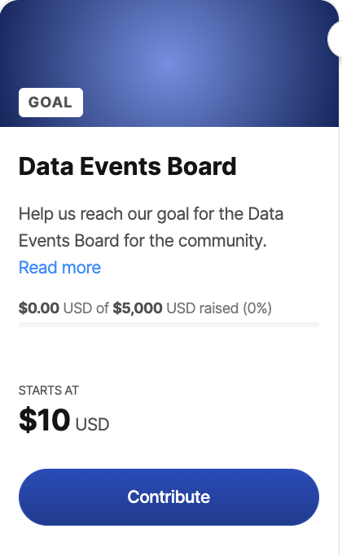

Author: [Reshama Shaikh](https://reshamas.github.io)  

## About the Event Board

Data Umbrella is building a community [Data Events Board](https://events.dataumbrella.org).  This platform is for the community to share their events. There are options to add events to a personal calendar and search by keywords and region.  This software platform uses open source software and the application code is publicly available (python, Django, React).

## Project Purpose & Inspiration

There are many community-driven data science events which have limited marketing resources to reach the community.  Having an event board with an option to subscribe to events makes events more accessible to those in the data science community.  It also alleviates the burden of labor intensive outreach. For example, community conferences such as PyCon, SciPy, ICML, NeurIPS, ACM FAccT, and more, are of relevance to the community.  But, currently, there is limited sharing of events because the resources are not available.  We also believe the limited availability of marketing resources directly impacts which communities are connected to community events, which results in reduced engagement by underrepresented persons.  By connecting our community to these events in an accessible fashion, we would like to achieve greater diversity in event participation (speakers, attendees, organizers).  

## Contribute to the Data Events Board

### Donations

To support this iniative, you can donate to our [project on Open Collective](https://opencollective.com/data-umbrella).

   
  

### GitHub Contributions
This platform was built using open source tools such as Python, Django and React.  There are various ways to contribute to the Data Events Board:
- [event-board-web/issues](https://github.com/data-umbrella/event-board-web/issues)
- [event-board-api/issues](https://github.com/data-umbrella/event-board-api/issues)

If you find any bugs or have any suggestions, please [contact us](https://events.dataumbrella.org/contact).

### References

- GitHub repo:  [event-board-web](https://github.com/data-umbrella/event-board-web)
- GitHub repo:  [event-board-api](https://github.com/data-umbrella/event-board-api)
- Sustainable Progress and Equality Collective [(SPEC)](https://www.specollective.org/)