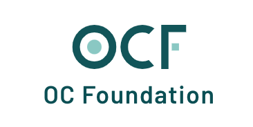

Summary posted by: [Reshama Shaikh](https://www.linkedin.com/reshamas)

## Intro
This article clarifies the difference between "Open Collective Foundation" and "Open Source Collective" and "Open Collective".

| Item     | Open Collective Foundation                                                               | Open Source Collective                                                                                                                                                                                                                                                                                                                             | Open Collective |
|----------|------------------------------------------------------------------------------------------|----------------------------------------------------------------------------------------------------------------------------------------------------------------------------------------------------------------------------------------------------------------------------------------------------------------------------------------------------|-----------------|
| Website  | [opencollective.foundation](https://www.opencollective.foundation/)   | [oscollective.org](https://www.oscollective.org/)     |     [opencollective.com](https://opencollective.com/search)           |
| Status   | 501(c)(3)                                                                                | 501(c)(6)     |  hosting platform               |
| Logo     |                          |            |                      |
| Address  | Open Collective Foundation 340 S. Lemon Avenue, #3717 Walnut, CA 91789             | Open Source Collective 340 S. Lemon Ave #3717 Walnut, CA 91789 USA                                                                                                                                                                                                                                                                           |                 |
| Tax ID   | EIN 81-4004928 DLN 17053184327027                                                     | EIN 82-2037583                                                                                                                                                                                                                                                                                                                                     |                 |
| Tax Info | **tax deductible**                                                                       | **not tax deductible**   Our income is not used for private or shareholder benefit.  Our resources, such as the fees we collect, are all invested  back into our mission: to promote a sustainable and healthy  open source ecosystem. Donations to Collectives hosted by the  Open Source Collective are not tax deductible. |                 |
| Region   | United States only                                                                       | Anywhere in the world  We can accept any open source project, in any language,  anywhere in the world.                                                                                                                                                                                                                                    |                 |
| Projects | We offer: nonprofit status + fundraising + accounting software  to aligned groups. | open source projects, meetup groups, conferences,  other initiative  We can also accept open source related  meetup groups and conferences, as well as advocacy, research,  and awareness initiatives.                                                                                                                              |                 |
|          |                                                                                          |                                                                                                                                                                                                                                                                                                                                                    |                 |
|          |                                                                                          |                                                                                                                                                                                                                                                                                                                                                    |                 |

