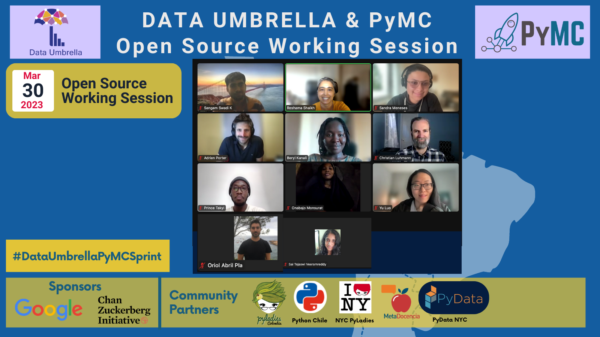
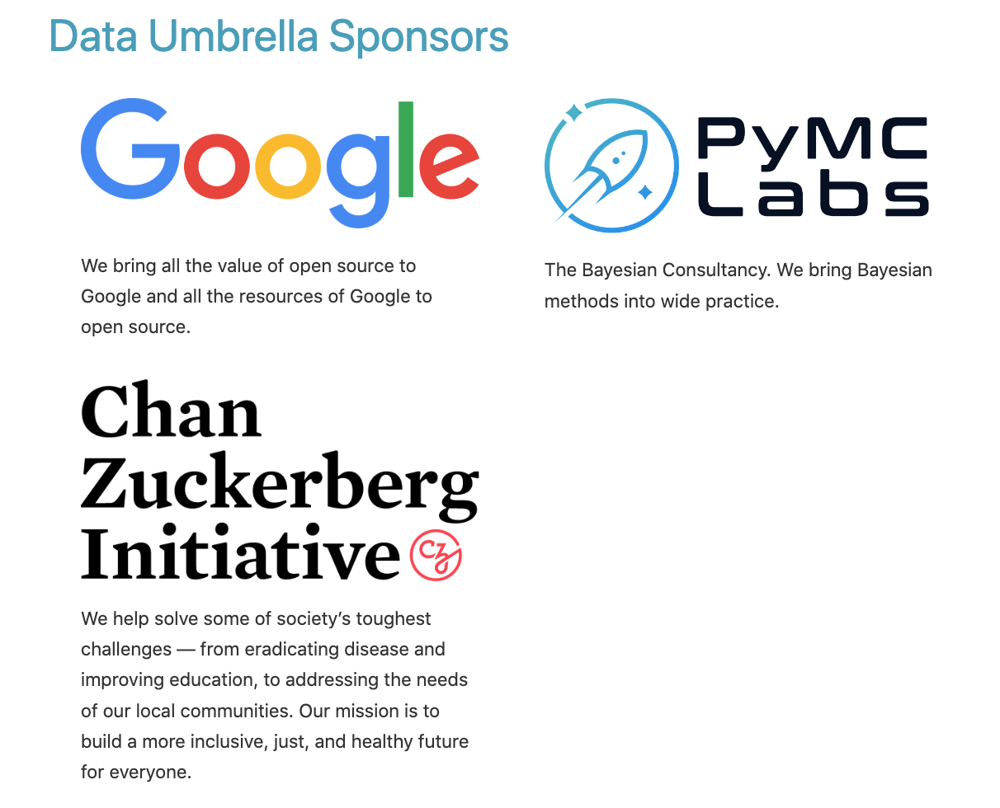

Author: [Reshama Shaikh](https://reshamas.github.io)  

   
  

## Key Information
- Event website: [pymc-data-umbrella.xyz](https://pymc-data-umbrella.xyz/en/latest/2023-03_sprint/index.html)
- Date of event: Thursday, March 30, 2023
- Time of event: 10am to 1pm ET

## High Level Summary
Number of participants who:  
- Registered: 19
- Attended:  9 (4 women; 5 men)
- Mentors:  6  (3 women; 3 men)
- Countries represented: 9

| Group                | Number of People     | Gender | Country                                 |
|----------------------|----------------------|--------|-----------------------------------------|
| Data Umbrella        | 2 (Beryl, Sangam)    | W, M   | Kenya, India                            |
| Data Umbrella & PyMC | 2 (Reshama, Sandra)  | W, W   | USA, Germany                            |
| PyMC                 | 2 (Oriol, Christian) | M, M   | Spain, USA                              |
| Community Members    | 9                    | 5M, 4W | USA (5), Canada, France, Ghana, Nigeria |

## Background
The PyMC open source working session was organized by [Data Umbrella](https://www.dataumbrella.org) to increase the participation of underrepresented persons in open source, python and data science.

## Event Sponsors

This event was supported by:  
- [Google Open Source](https://opensource.google/)
- [Chan Zuckerberg Initiative](https://chanzuckerberg.com/science/programs-resources/open-science/communitiesofpractice/data-umbrella/) (2-year [Communities of Practice](https://chanzuckerberg.com/science/programs-resources/open-science/communitiesofpractice/data-umbrella/) grant)

   
  

## Pull Requests Submitted

### Add contributor info to event website
1. @symeneses, @alporter08 [pymc-data-umbrella PR#219](https://github.com/pymc-devs/pymc-data-umbrella/pull/219) (merged)
1. @reshamas, @vsaitejaswie [pymc-data-umbrella PR#221](https://github.com/pymc-devs/pymc-data-umbrella/pull/221) (merged)
1. @SangamSwadiK, @iykat [pymc-data-umbrella PR#224](https://github.com/pymc-devs/pymc-data-umbrella/pull/224) (merged)

### Doc / Code contributions
1. @SangamSwadiK, @iykat [pymc PR#6635](https://github.com/pymc-devs/pymc/pull/6635) (merged)
1. @symeneses, @alporter08 [pymc PR#6638](https://github.com/pymc-devs/pymc/pull/6638) (merged)
1. @BerylKanali, @Monsurat-Onabajo [pymc-examples PR#538](https://github.com/pymc-devs/pymc-examples/pull/538) (merged)
2. @iykat [pymc PR#6635](https://github.com/pymc-devs/pymc/pull/6635) (open)
3. @daniel-saunders-phil [pymc PR#6609](https://github.com/pymc-devs/pymc/pull/6609 (open) joined April 2023 study group

## Resources Created for the Sprint

### Gitpod

- Ben Meares of the PyMC Team set up a Gitpod container for the pymc repository. 
- Sangam SwadiK tested the Gitpod container.
- Reshama Shaikh wrote up instructions, [Using Gitpot to Contribute to PyMC](https://www.pymc.io/projects/docs/en/latest/contributing/using_gitpod.html).
- Reshama Shaikh created a video on How to Contribute to PyMC Using Gitpod.

<iframe width="560" height="315" src="https://www.youtube.com/embed/jsjOmhUaKuU" title="YouTube video player" frameborder="0" allow="accelerometer; autoplay; clipboard-write; encrypted-media; gyroscope; picture-in-picture; web-share" allowfullscreen></iframe>

### Website Translations
- Oriol Abril Pla and Sandra Yojana Meneses worked together to set up the event website so it could be translated using the [platform Transifex](https://explore.transifex.com/pymc/data-umbrella-sprints-website/). 
- Reshama Shaikh wrote up [Language Instructions](https://pymc-data-umbrella.xyz/en/latest/contributing/language-translations.html) so contributors could submit translations using Transifex.

#### Website Translators

We would like to thank all the community members who contributed to translating the website to Spanish or Portuguese:

- Sandra Yojana Meneses
- Cristina Mulas Lopez
- Ariel Silvio Norberto Ramos
- Alberto Mario Ceballos-Arroyo
- Jose Rafael Camejo
- Juliana Almeida
- Cristián Maureira-Fredes
- Anavelyz Perez
- César Herrera
- Barbara Graniello Batlle
- Cristina Zenteno
- Leonardo Gomez

## Pair Programming

Participants worked in pairs.  We paired experienced contributors with new contributors.

## Event Info
- No participants joined from Latin America, though ~10 people from Latin American did register for the event.
- We expect that the website translations, particularly in Spanish, will be beneficial for the community, even after this event.

## What's Next: Maintaining the Momentum
We have already seen a few event participants continue to contribute after the event.

We hope to maintain the momentum by holding casual monthly "study groups" on Discord to continue contributing to PyMC.

## Social Media Promotion

Below are some of the social media announcements on the open source working sessions.

### Twitter (English)

<blockquote class="twitter-tweet">
🧵 📣Join us: *online* working session to contribute to <a href="https://twitter.com/pymc_devs?ref_src=twsrc%5Etfw">@pymc_devs</a> <a href="https://twitter.com/hashtag/oss?src=hash&amp;ref_src=twsrc%5Etfw">#oss</a> 👉🏽with a focus on underrepresented persons in <a href="https://twitter.com/hashtag/DataScience?src=hash&amp;ref_src=twsrc%5Etfw">#DataScience</a> &amp; Latin America 🗓️ Mar 30, 2023: 15-18:00 UTC    Submit a registration form:<a href="https://t.co/ex9GnULvGl">https://t.co/ex9GnULvGl</a> <a href="https://t.co/xQRlivsW3o">pic.twitter.com/xQRlivsW3o</a>
&mdash; Data Umbrella (@DataUmbrella) <a href="https://twitter.com/DataUmbrella/status/1631300676994097154?ref_src=twsrc%5Etfw">March 2, 2023</a></blockquote> 

### LinkedIn (English)

[LinkedIn announcement](https://www.linkedin.com/feed/update/urn:li:activity:7037049981739900931/)

## Acknowledgments

We thank the [Data Umbrella & PyMC organizers](https://pymc-data-umbrella.xyz/en/latest/2022-07_sprint/sprint_parties/organizers.html#data-umbrella-organizers) who created the website, created event documents, conducted outreach, marketing and so much more!  
- Reshama Shaikh
- Beryl Kanali
- Sandra Meneses
- Cristina Mulas Lopez
- Christian Luhmann
- Oriol Abril Pla
- Sangam SwadiK

### References

- [PyMC sprints organized by Data Umbrella](https://pymc-data-umbrella.xyz/en/latest/sprint_events.html)
- Report: [Data Umbrella & PyMC July-August 2022 Open Source Sessions](https://blog.dataumbrella.org/data-umbrella-pymc-2022-report)
- Report: [Reflections on the Data Umbrella PyMC February 2022 Sprint](https://blog.dataumbrella.org/pymc-sprint-summary)
- Interview with Sandra Meneses: [Contributing to PyMC](https://blog.dataumbrella.org/sandra-sprints)
- [Data Umbrella scikit-learn Sprint Reports](https://blog.dataumbrella.org/tags/#sprint-report)

## Addendum
- [no addendums or updates at the time of publication]
