Author: [Reshama Shaikh](https://reshamas.github.io)  

   
  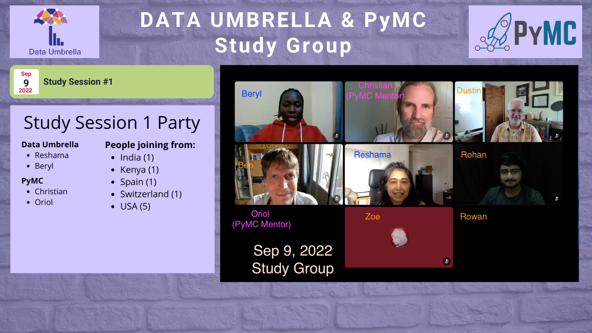

## Background
Data Umbrella organized a series of 5 sessions over two months: [July & August 2022 PyMC Open Source Working Sessions](https://blog.dataumbrella.org/data-umbrella-pymc-2022-report).  After that Data Umbrella held monthly 2-hour sessions referred to as "Study Group" or "Open Source Sessions".  It was an opportunity for prior contributors from the Data Umbrella/PyMC OS Working Sessions to continue contributing with the presence of mentor(s) from the PyMC team.

From September 2022 to August 2023, we held a total of 12 sessions.

## Contributions Statistics

The contributions during the working sessions were tracked in this [PyMC OS-WS spreadsheet](https://docs.google.com/spreadsheets/d/11aUZN_iqPF4-oWNvFKhkPIMYLizVE_EmoHugX7kGgHY/edit?usp=sharing).  Contributions included both submitting a pull request and opening an issue where observed. 

This was a manual process and imperfect. Not all pull requests were recorded in this spreadsheet.

## Event Sponsors

This event was supported by:  
- [Chan Zuckerberg Initiative](https://chanzuckerberg.com/science/programs-resources/open-science/communitiesofpractice/data-umbrella/) (2-year [Communities of Practice](https://chanzuckerberg.com/science/programs-resources/open-science/communitiesofpractice/data-umbrella/) grant)
- [Google Open Source](https://opensource.google/)

   
  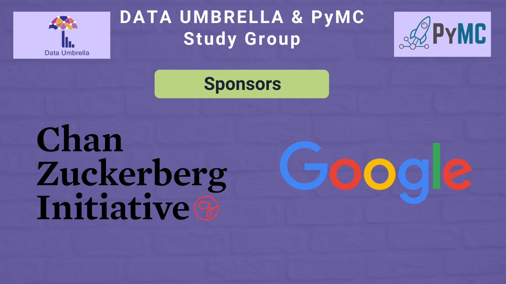

---

### Sessions 1 & 2

   
  
   
  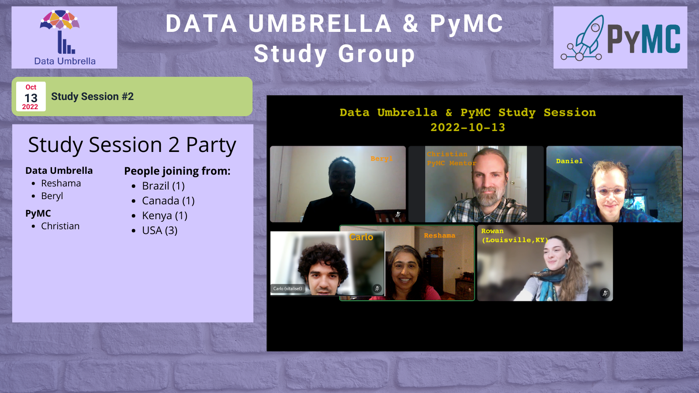 

### Sessions 3 & 4

   
  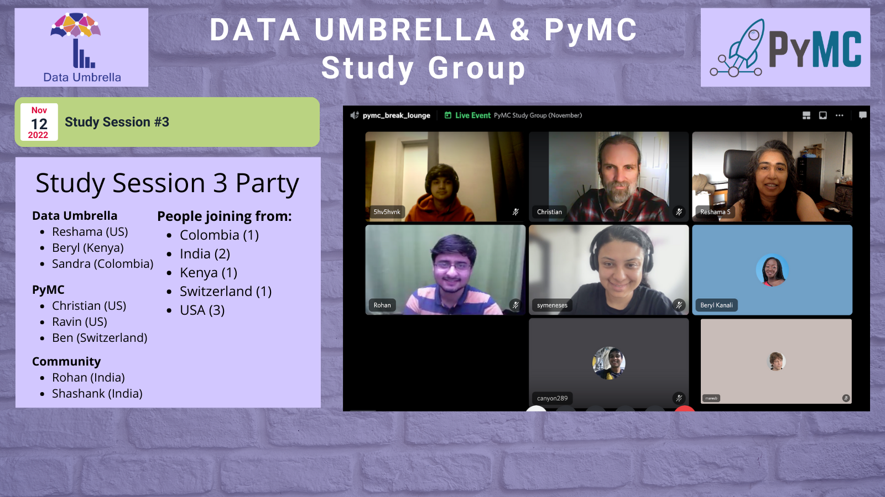
   
  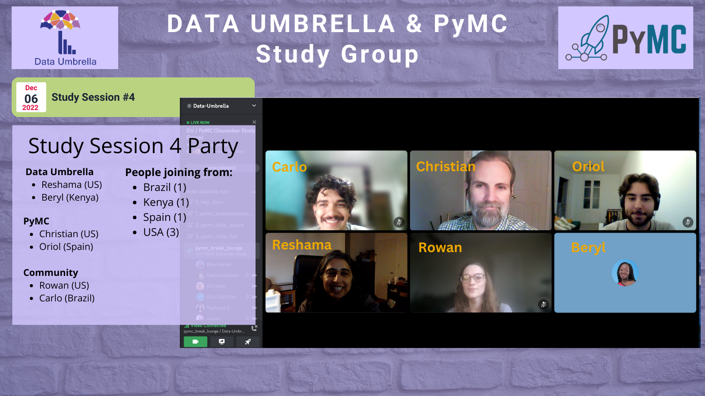 

### Sessions 5 & 6

   
  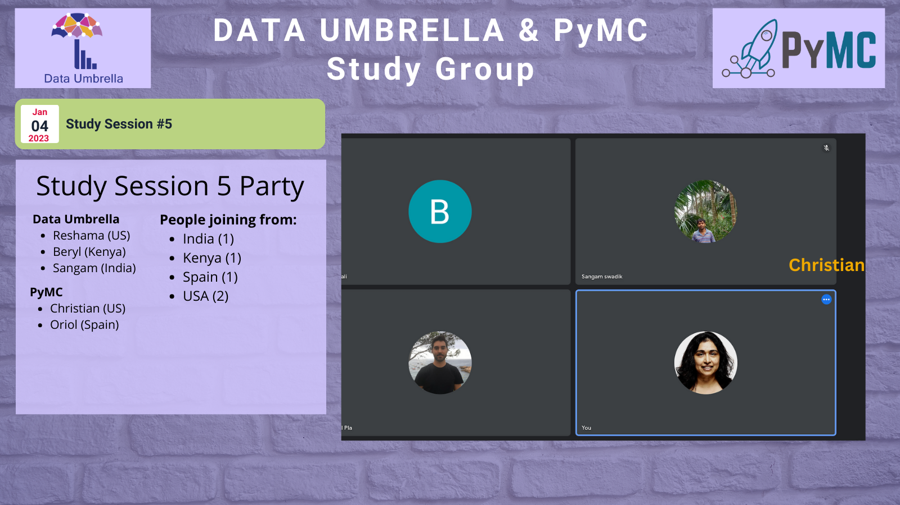
   
  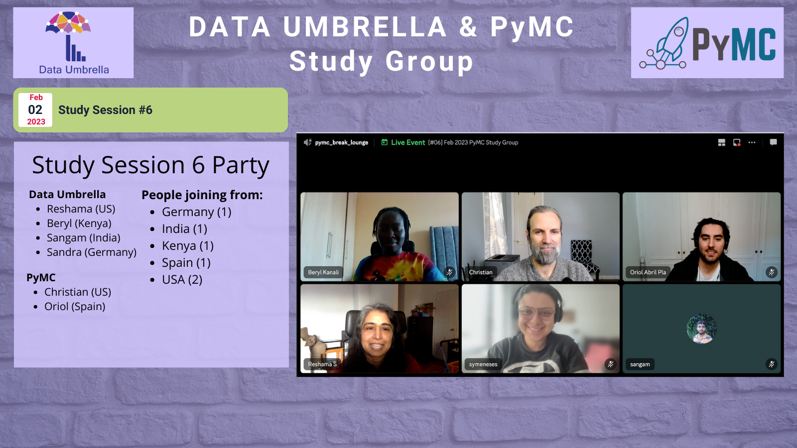 

### Sessions 7 & 8

   
  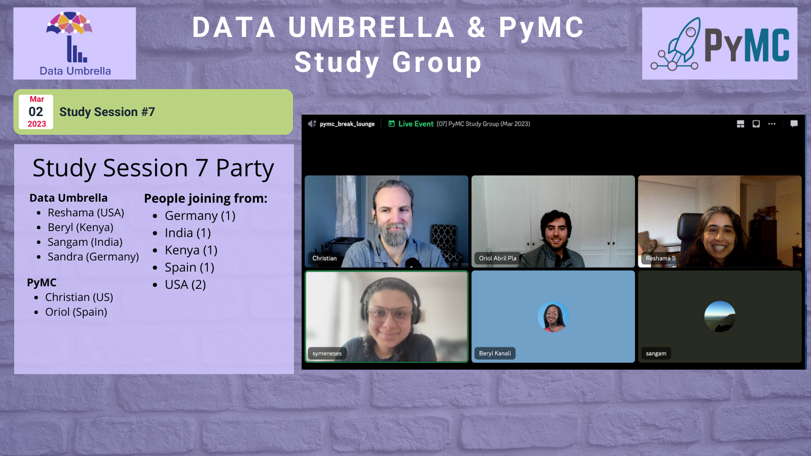
   
  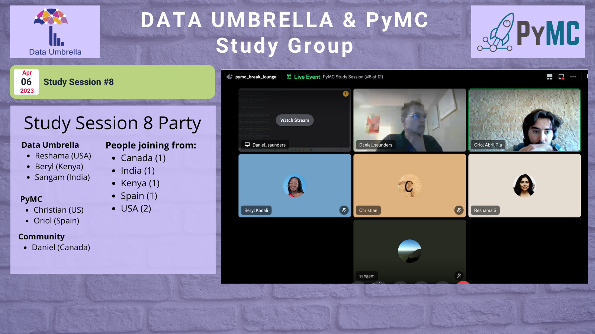 

### Sessions 9 & 10

   
  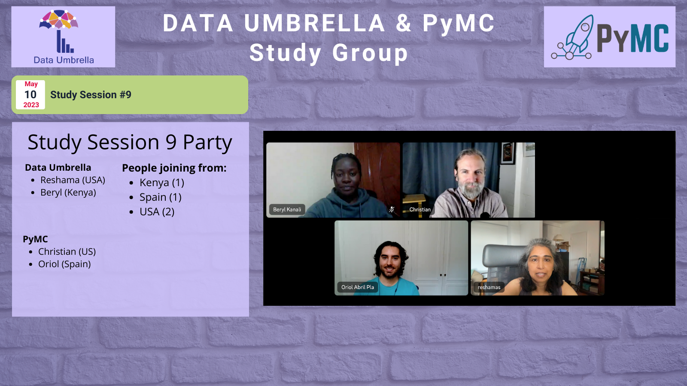
   
  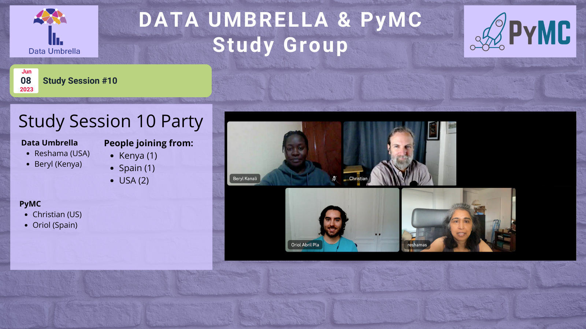 

### Sessions 11 & 12

   
  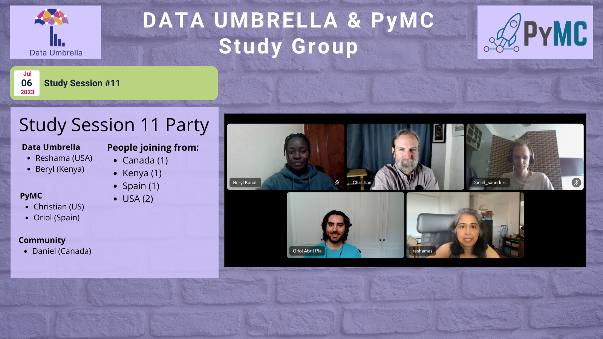
   
  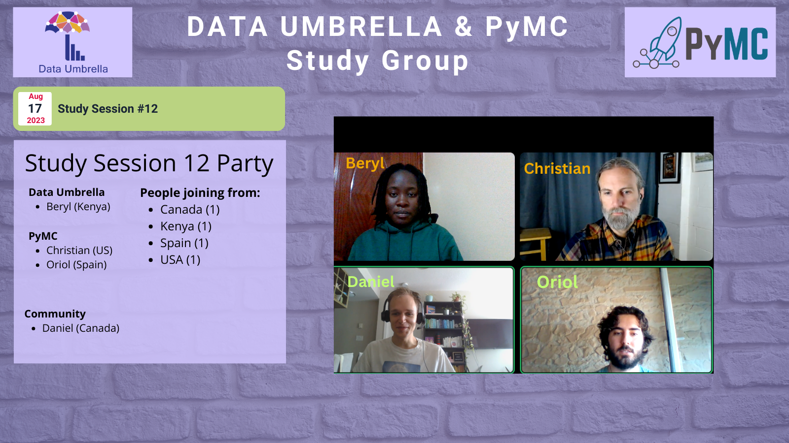 

## Feedback / Lessons Learned / Challenges

### What worked well?

- The sessions were well spaced and at a convenient time to accommodate various time zones.
- Having "mentors" (Christian and Oriol) was great since we were able to consult and solve issues, ask questions and go through errors one on one.
- It was really helpful to have a couple experienced contributors around. So much of navigating open source contributions relies on knowledge that's hard to find unless someone is willing to be patient and hold your hand through it. So being able to drop in every month or so and get some help was extremely useful. 
- What worked well for me was the hands-on tasks like fixing notebook issues and ensuring their compatibility with recent PyMC versions. These tasks provided a clear direction and objective. However, given that PyMC was a new territory and with my limited background in Bayesian modelling, the depth and pace of some discussions felt overwhelming.
- I thought the sessions themselves worked quite well, with fewish people attending a at least a couple mentors that could go jumping around and answering questions. In fact, in many of the sessions I was abpe to spend significant time working on my own PRs thanks to this high mentor/attendee ratio. 
- I think the participants enjoyed the sessions because 
  - 1) we had dedicated PyMC developers to help us and review our PRs, 
  - 2) people in the sessions were welcoming and supportive, and 
  - 3) there were simple issues to work on. 
- Participants were enthusiastic, and the mentors were dedicated and passionate.
- The core developers and the Data Umbrella team are extremely helpful and instructive and I felt welcomed and respected. I learned a lot on all fronts: about Bayesian inference theory, non-trivial functionalities of git etc.

### Did you enjoy and find value in the sessions?
- Yes. It helped me understand more about contributing to open source, Git and Bayesian statistics.
- Yeah I did. It was also nice to casually chat with contributors to get a sense of the community. 
- I really liked the sessions. It was great to see how my work get merged on the repo, and I learned a bit about PyMC from the hands-on tasks.
- Yes, I enjoyed the sessions and I think they were valuable both to the project and to the attendees, the main issue is as I have mentioned is the initiative not being followed through completely.
- Yes, I could finish few PRs in these sessions and it felt nice to be doing something good for the community while having good company. Also, I got some doubts clarified which helped for my personal learning. 
- Absolutely. Having immediate support from core developers resolves doubts that could take days or weeks to clear up asynchronously.

### Challenges 
- I find it challenging [to provide feedback on the sessions] precisely because of my limited participation. I don't use PyMC on a daily basis. Therefore, I would face a significant overhead in having to study some aspects in depth before making more sophisticated PRs. This is why I eventually decided to stop attending the meetings.
- It's difficult to get started in these sessions as every person is expected to select an issue and to work individually. 
- Given that PyMC was a new territory and with my limited background in Bayesian modelling, the depth and pace of some discussions felt overwhelming.
- What didn't work so well in my opinion was continuity. Only people from Data Umbrella or from PyMC attended the sessions regularly, which I think is a great opportunity loss as, in my opinion, attending twice the sessions translates in far more than twice the learnings. 
- It was unfortunate that fewer people than expected attended the study groups.  However, it was an excellent time to get extended 1-on-1 time with a PyMC maintainer.
- We had contributors from the West Coast of United States and Canada over to India, which spans 13.5 hours.  It was challenging to find times which accommodated the schedule of all participants.

### What pull requests did you work on?
- [Beryl] I worked on rerunning and updating the notebooks for compatibility with the latest PyMC version. 
- [Daniel] I worked on three during the sessions
  - [6652](https://github.com/pymc-devs/pymc/pull/6652)
  - [6693](https://github.com/pymc-devs/pymc/pull/6693) 
  - [547](https://github.com/pymc-devs/pymc-examples/pull/547)
- [Sangam] I contributed to the following tasks:
  - Fixed issues in notebook examples.
  - Re-ran notebooks to ensure compatibility with the latest PyMC versions and made necessary adjustments when discrepancies were found.- Assisted in setting up and testing the development environment on GitPod.
- [Oriol] I didn't keep a list of the PRs I reviewed, I know I worked on [539](https://github.com/pymc-devs/pymc-examples/pull/539) myself, will double check other work done during sessions that wasn't reviewing or answering questions
- [Sandra] 
  - [55](https://github.com/pymc-devs/pymc.io/pull/55)
  - [56](https://github.com/pymc-devs/pymc.io/pull/56)
  - [6556](https://github.com/pymc-devs/pymc/pull/6556)
  - [6292](https://github.com/pymc-devs/pymc/pull/6292)
- [Zoe] I worked on YouTube video descriptions and installation requirements documentation.
- [Carlos] During the few meetings I attended (1 or 2), I did not create any new PRs. I spent time discussing open PRs with the core developers and gaining insight into some of the API decisions.

### Suggestions for improvement
- During the few meetings I attended (1 or 2), I did not create any new PRs. I spent time discussing open PRs with the core developers and gaining insight into some of the API decisions.
- Not completely sure how, but I think the best case scenario would be to have more regular attendance. Maybe an option could be to start with a ~15 min meeting with one of the mentors to work on a contribution plan that is specific to each person and builds their skills in a planned manner along the sessions until half the initiative or so when they'd be able to tackle a biggish PR of their choice (or partially their choice)
- I think people joining would be interested in learning about Bayesian Statistics in general, which is not a topic most people know about. Having a 10-15 minutes explaining a topic which has open issues at the moment can help to get people working on those issues.
- It would be nice that participants could have a sense of progression (for example, the ones closing a PR level 0 can move to level 1), this could help to keep attendants motivated.
- There were not so many people attending, it could help to invite new contributors (people who get their first PR merged in any PyMC repo) to the sessions in a way that is like a support program for contributors while keeping a small manageable group.
- Perhaps expanding the group to include other libraries could be an option. I'm not sure about the logistics, but doing this with numpy, pandas, scikit-learn etc, might be worthwhile.

### Other feedback and comments
- Overall, the series worked well for me. I didn't have time to commit to attending regularly. But the fact that they did happen regularly and I could drop in and out was really helpful. 
- For future sessions, it might be beneficial to have sessions specifically for beginners that introduce PyMC to those not from a Bayesian modelling background, before they begin contributing.This would make the learning curve smoother for newcomers.
- These study session enabled me to build my skills in open source. They were a very good way to also learn more about git and Bayesian statistics. 
- I'm grateful for this experience. It opened up a new avenue of learning for me, and I'm keen to delve deeper and contribute more in the coming times.
- Thank you for organizing the sessions! I hope to be able to join again if there are similar sessions in the future.
- Reshama and the PyMC leadership team deserve an award for their dedicated mentorship.

### References
- [PyMC sprints organized by Data Umbrella](https://pymc-data-umbrella.xyz/en/latest/sprint_events.html)
- [Data Umbrella / PyMC March 2023 Open Source Session Report](https://blog.dataumbrella.org/du-pymc-2023-sprint)
- Report: [Data Umbrella & PyMC July-August 2022 Open Source Sessions](https://blog.dataumbrella.org/data-umbrella-pymc-2022-report)
- Report: [Reflections on the Data Umbrella PyMC February 2022 Sprint](https://blog.dataumbrella.org/pymc-sprint-summary)
- Interview with Sandra Meneses: [Contributing to PyMC](https://blog.dataumbrella.org/sandra-sprints)
- [Data Umbrella scikit-learn Sprint Reports](https://blog.dataumbrella.org/tags/#sprint-report)

## Addendum
- [no addendums or updates at the time of publication]
