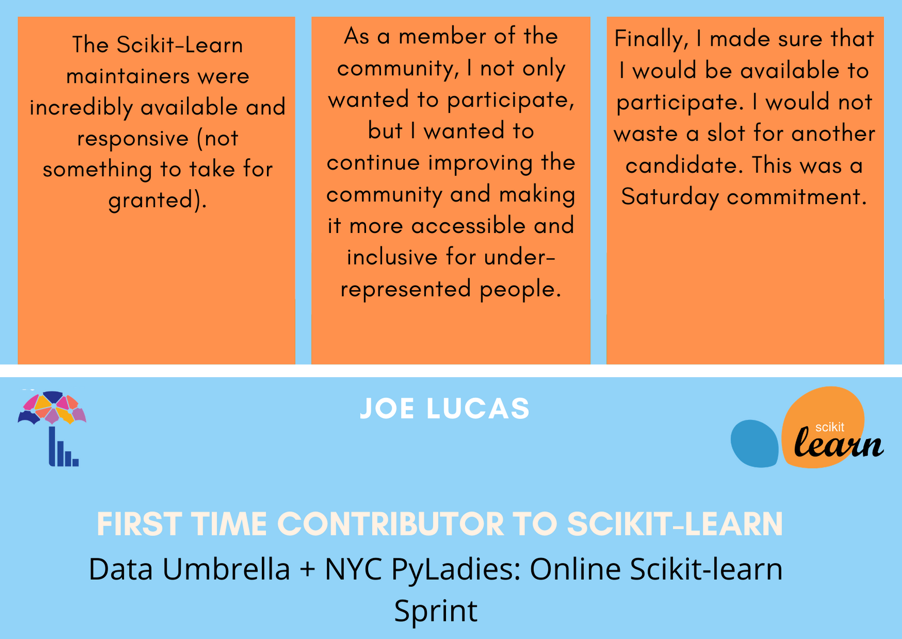

Authors:  [Reshama Shaikh](https://reshamas.github.io), [Beryl Kanali](https://github.com/BerylKanali) & [Joe Lucas](https://github.com/JosephTLucas)

   
  

1. __Tell us about yourself.__

   I’ve moved all over the United States, but I’m originally from Pennsylvania and now live in Texas with my wife and two daughters. I just bought a pair of cowboy boots, so I guess you can say I’m getting used to the change. I’m currently on the AI Red Team at NVIDIA, which perfectly blends my two professional interests: math and cybersecurity. “Red Teaming” comes from the concept of “red versus blue” where the Blue team consists of developers and security folks, while the Red team thinks and acts like the adversary. By red teaming, we test defensive tools and processes to help provide recommendations. In the end, we’re all contributing towards a more secure product and developer ecosystem. So an AI Red Team performs security reviews, penetration tests, and adversary emulation operations to probe and test the security of MLOps and deployed AI systems. I originally got interested in the machine learning security field when I learned about adversarial images (images that look correct to humans but are intentionally misclassified by classifiers), but the ride has gotten wilder since the most recent AI wave.

2. __How did you learn of the [scikit-learn June 2020](https://sites.google.com/view/nyc-2020-scikit-sprint/) (first online) global sprint, organized by Data Umbrella?__

    I think I saw it announced on Twitter. At the time, I was just leaving the Army and it had always been one of my goals to contribute to Open Source. I had been using scikit-learn in my job as a data scientist and this seemed like the perfect opportunity to learn how to give back.

3. __How was your experience?__

    I’m incredibly grateful for the experience. At the time, I understood the concept of open source software, but didn’t really understand how to actively deliver and contribute (especially to a project as established as scikit-learn). The structure of the Data Umbrella sprint resolved many of these unknowns and enabled me to feel like I’d both made a meaningful contribution and learned how to interact in the open source community.

    I wrote an article sharing my experience, “[My Open Source Adventure](https://blog.dataumbrella.org/joe-lucas-online-2020-my-open-source-adventure)” to document and share my experience.

4. __What was the value of the open source sprint? How has that shaped your path in open source?__

    The sprint gave me the experience and confidence to continue engaging with open source projects. I learned more about maintainers’ perspectives and challenges and now understand that there is a wide spectrum of valuable contributions.

5. __To which OSS projects and communities do you contribute?__

	The Data Umbrella sprint showed me that not all valuable contributions are new features; there may be tests, documentation, or continuous integration modifications, for example. Lately, I’ve been identifying ways to leverage my professional application security experience to contribute security to projects. I started out with joining the Jupyter Security Subcouncil and have recently been contributing as the chair for the [NumFOCUS](https://numfocus.org/) Security Committee. Just like I learned during the Data Umbrella sprint, we can contribute to the security of the projects we use and appreciate through education, establishing standards, enhancing processes, technical reviews, and security services.

6. __Any advice or tips you have for people starting out in open source?__

	Just do it! Be aware that you will likely need help from the maintainers, and that help is part of the larger open source “gift economy”. Be gracious, communicative, and willing to learn.

7. __What are your favorite resources, books, courses, conferences, etc?__

	More than recommending a specific conference, I’ll recommend that you submit to speak at a conference. It’s a great mechanism to really test your understanding of a material and meet people with similar interests. Even if you’re new to these communities, you likely will have some valuable experience to share and many conferences offer mentors to help new presenters prepare.

8. __What are your hobbies, outside of work and open source?__

	I have too many hobbies… lately I’ve been spending a lot of time training my puppy and trying to learn how to skateboard (inspired by the Olympics).
## Resources for Contributing to scikit-learn

- [Contributing to scikit-learn blog](https://www.dataumbrella.org/open-source/contributing-to-scikit-learn)
- [Scikit-learn develope's guide](https://scikit-learn.org/dev/developers/index.html)

## References

- [Joe Lucas: scikit-learn Open Source Adventure](https://josephtlucas.github.io/blog/content/sklearn_sprint.html)
